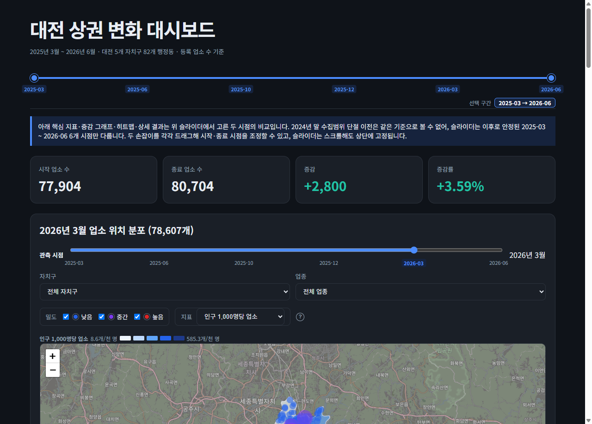
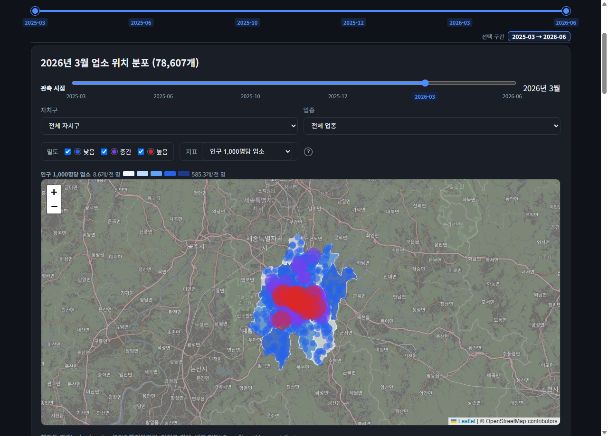
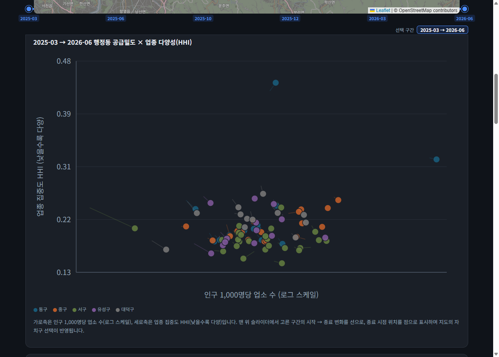
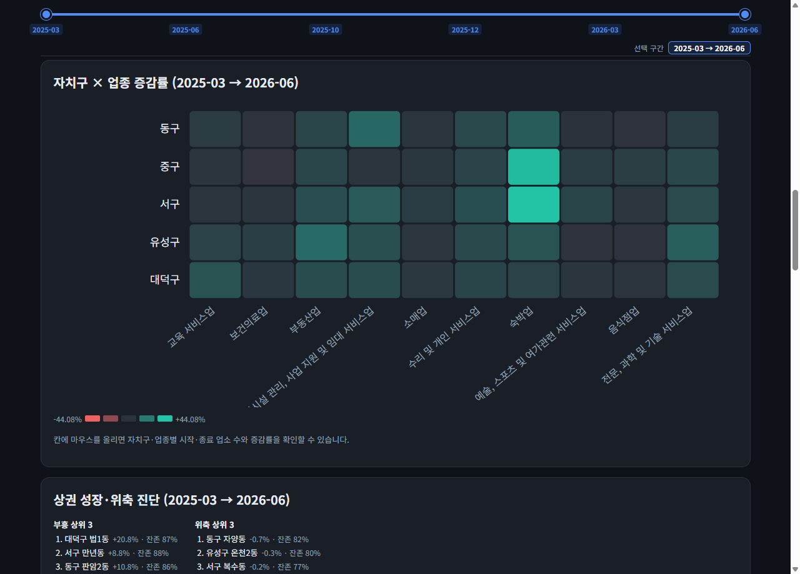
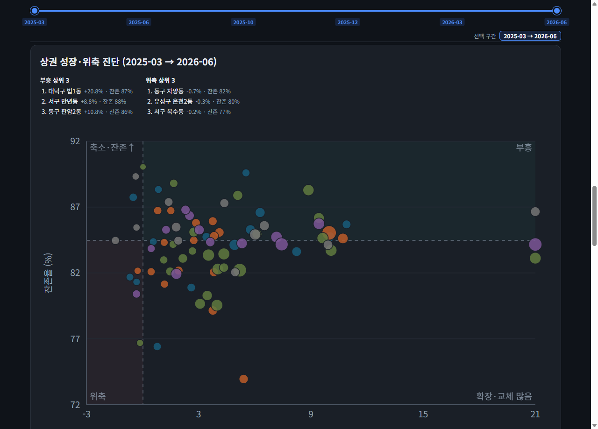
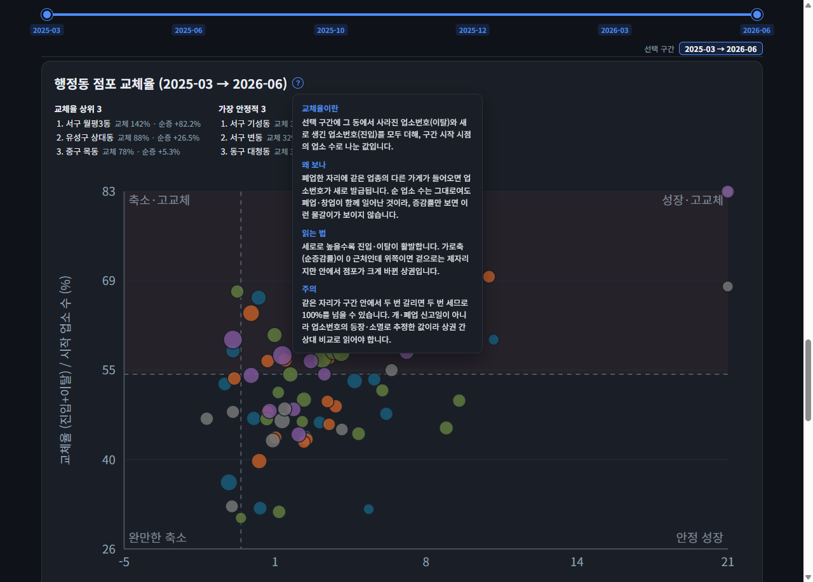
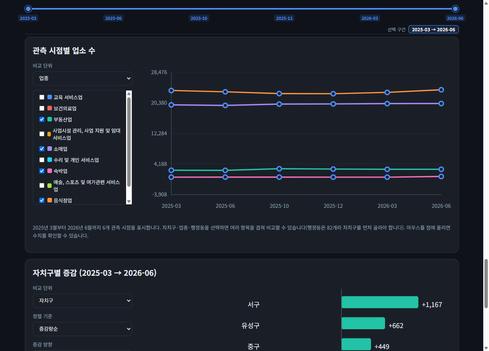
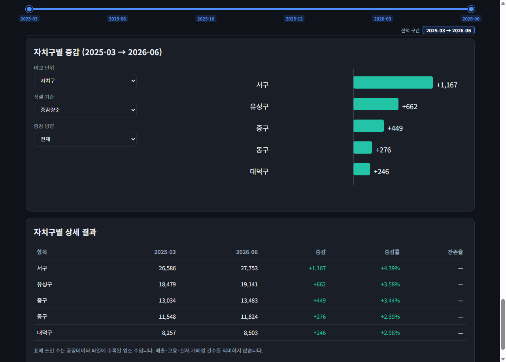

# 대전 상권 데이터 분석

> **"가게가 몇 개인가"가 아니라 "인구에 비해 얼마나 촘촘한가, 어떤 업종에 쏠렸나, 가게가 얼마나 자주 바뀌나"로 대전 82개 행정동의 상권을 들여다본 프로젝트입니다.**

[](https://www.python.org/)
[](analysis.ipynb)
[](https://www.data.go.kr/data/15083033/fileData.do)
[](REPORT.md)

**바로가기:** [📈 인터랙티브 대시보드 열기](https://frost0313z.github.io/daejeon-commercial-analysis/) · [📘 분석 리포트](REPORT.md) · [🧭 분석 계획](ANALYSIS_PLAN.md) · [📓 기초 분석 노트북](analysis.ipynb)

---

## 목차

1. [이 프로젝트가 답하려는 질문](#1-이-프로젝트가-답하려는-질문)
2. [30초 요약](#2-30초-요약)
3. [대시보드 따라 보기](#3-대시보드-따라-보기)
4. [용어 사전](#4-용어-사전)
5. [만들면서 했던 고민과 해결](#5-만들면서-했던-고민과-해결)
6. [데이터 출처](#6-데이터-출처)
7. [직접 실행해 보기](#7-직접-실행해-보기)
8. [파일 안내](#8-파일-안내)
9. [해석할 때 주의할 점](#9-해석할-때-주의할-점)

---

## 1. 이 프로젝트가 답하려는 질문

상가 수가 많다고 상권이 좋은 건 아닙니다. 인구 10만 명 동네의 가게 500개와 인구 3천 명 동네의 가게 500개는 완전히 다른 이야기입니다. 이 프로젝트는 **대전시 상가정보에 행정동별 주민등록인구를 붙여서** 다음을 봅니다.

1. 인구에 비해 점포가 촘촘한 동네는 어디인가?
2. 특정 업종이 대전 평균보다 쏠려 있는 동네는 어디인가?
3. 업종이 골고루 섞인 상권과 한 업종에 집중된 상권은 어디인가?
4. 고령·청년 인구 비율과 업종 구성은 관련이 있는가?
5. 한 번 생긴 가게가 오래 버티는 동네는 어디인가?
6. 특정 업종으로 창업한다면 경쟁이 적은 동네와 이미 포화된 동네는?
7. 최근 1년, 점포가 늘어나는 상권과 정체된 상권은 어디인가?
8. 순 가게 수는 그대로여도 폐업·창업이 맞물려 점포가 자주 바뀌는 상권은?

결과물은 두 가지입니다. **브라우저에서 슬라이더를 돌려 보는 대시보드**(`interactive-dashboard.html`)와 방법·근거·한계를 정리한 **리포트**([REPORT.md](REPORT.md)).

> 매출·유동인구 데이터는 없습니다. 그래서 이 분석은 "장사가 잘 되는가"가 아니라 **"점포 공급이 어떻게 놓여 있고 어떻게 움직이는가"**만 봅니다. 이 전제는 계속 반복해서 짚습니다.

---

## 2. 30초 요약

- **원도심은 인구 대비 점포가 압도적으로 많다.** 동구 중앙동은 주민 1,000명당 585개로 82개 동 중앙값(49개)의 약 12배. 상주인구는 적고 외부 방문 수요가 큰 상업지라 이렇게 나옵니다. 과밀·성공의 신호가 아니라 "상주인구만으로 수요를 재면 도심이 크게 보인다"는 구조.
- **성장은 외곽 신시가지에 몰린다.** 최근 1년(2025-03~2026-06) 5개 자치구는 모두 +2~4% 늘었지만, 행정동으로 쪼개 보면 서구 월평 일대·유성 도안·테크노(상대·구즉)가 두 자릿수로 크는 반면 일부 노후 생활권은 제자리.
- **"제자리"인 상권도 안에서는 크게 갈린다.** 대전 전체 15개월 교체율은 54.7%. 중구 대흥동은 순 점포 수가 +0.4%로 멈춰 있지만, 시작 점포의 약 3분의 2가 폐업·창업으로 바뀌었습니다. 순 가게 수만 보면 놓치는 부분.

숫자의 배경과 한계는 [REPORT.md](REPORT.md)에 있습니다.

---

## 3. 대시보드 따라 보기

**바로 보기: <https://frost0313z.github.io/daejeon-commercial-analysis/>** (GitHub Pages, 별도 설치 없음)

로컬에서 보려면 `interactive-dashboard.html` 한 파일만 내려받아 브라우저로 열면 됩니다. 데이터가 파일 안에 들어 있어 서버·DB가 필요 없고, 배경 지도만 인터넷 연결이 필요합니다. 아래는 위에서 아래로 스크롤하며 보는 순서 그대로입니다.

### 3-0. 맨 위 — 비교 구간 슬라이더



가장 위에 **두 손잡이 슬라이더**가 있습니다. 왼쪽 손잡이가 "시작 시점", 오른쪽 손잡이가 "종료 시점"입니다. 이 두 시점을 정하면 아래의 카드·그래프·히트맵·진단이 **전부 그 구간 기준으로 다시 계산**됩니다.

- 다룰 수 있는 시점은 **2025-03, 2025-06, 2025-10, 2025-12, 2026-03, 2026-06** 6개뿐입니다. 2024년이 없는 이유는 [5장](#5-만들면서-했던-고민과-해결)에서 설명합니다.
- 기본값은 처음(2025-03) → 끝(2026-06), 즉 있는 데이터 전 구간입니다.

바로 아래 **핵심 지표 카드 4개**는 선택 구간의 대전 전체 시작 업소 수, 종료 업소 수, 증감, 증감률을 보여줍니다.

### 3-1. 업소 위치 분포 지도



각 원은 **0.01도 격자(약 1km) 안 점포들의 평균 위치**이고, 원이 클수록 그 격자에 점포가 많다는 뜻입니다. 개별 가게의 정확한 주소는 공개하지 않으려고 격자로 뭉쳤습니다.

- **관측 시점 슬라이더**(지도 위): 6개 시점 중 하나를 골라 그 시점의 분포를 봅니다.
- **자치구 / 행정동 / 업종 필터**: 자치구를 고르면 지도가 그 구역으로 확대되고, 그 안의 행정동을 다시 고르면 해당 동만 강조됩니다.
- **밀도 필터**(낮음·중간·높음): 원의 크기 구간을 켜고 끕니다.
- **지표 색칠**: "인구 1,000명당 업소 / 업종 집중도(HHI) / 고정 코호트 잔존율" 중 하나를 고르면 행정동 경계 안이 색으로 칠해집니다. 색이 진할수록 값이 큽니다. 옆의 **`?` 아이콘**에 마우스를 올리면 각 지표 설명이 뜹니다.

### 3-2. 공급 밀도 × 업종 다양성 산점도



점 하나가 행정동 하나입니다.

- **가로축 = 공급 밀도** (인구 1,000명당 점포 수, 로그 눈금). 오른쪽일수록 인구 대비 점포가 촘촘.
- **세로축 = HHI(업종 집중도)**. 아래쪽일수록 업종이 골고루 섞여 있고, 위쪽일수록 한 업종이 그 동네 상권을 독식.
- 선택 구간의 **시작 → 종료 변화**를 짧은 선으로, 종료 시점 위치를 점으로 표시합니다. 선이 길수록 그 구간에 크게 움직인 동네.
- 네 모서리에 붙은 이름(종합 상권 / 특화 밀집 / 생활 분산형 / 저활성·단일업종)은 밀도·다양성의 중앙값으로 나눈 4분면 이름입니다.

### 3-3. 자치구 × 업종 증감률 히트맵



세로 5칸이 자치구, 가로 10칸이 업종 대분류입니다. 칸 색이 **청록이면 그 구간에 그 조합의 점포가 늘었고, 빨강이면 줄었습니다.** 칸에 마우스를 올리면 시작·종료 점포 수와 증감률이 뜹니다. 한눈에 "어느 자치구의 어느 업종이 크고 작게 움직였나"를 봅니다.

### 3-4. 상권 성장·위축 진단



행정동을 두 축으로 흩뿌립니다.

- **가로축 = 업소 수 증감률** (선택 구간). 오른쪽이면 점포가 늘어난 동네.
- **세로축 = 고정 코호트 잔존율.** 선택 구간 시작 시점에 있던 점포 중 종료 시점까지 **같은 업소번호로 남아 있는 비율**입니다. 위쪽일수록 기존 점포가 잘 버티는 동네.
- 점 크기는 순증·순감 규모, 점선은 증감률 0%와 잔존율 중앙값.
- **오른쪽 위(부흥)** = 점포도 늘고 기존 점포도 잘 남음. **왼쪽 아래(위축)** = 줄고 교체도 빠름.
- 위쪽 요약에 부흥·정체 상위 3개 동이 나옵니다.

### 3-5. 행정동 점포 교체율



3-4가 "기존 점포가 **남았나**"를 봤다면, 이 패널은 "얼마나 **갈렸나**"를 봅니다. 제목 옆 **`?` 아이콘**에 용어 설명이 붙어 있습니다.

- **가로축 = 순증감률** (3-4와 같은 값).
- **세로축 = 교체율.** 선택 구간에 그 동네에서 **사라진 업소번호(이탈)와 새로 생긴 업소번호(진입)를 모두 더해, 시작 시점 점포 수로 나눈 값**입니다.
- 세로로 높을수록 진입·이탈이 활발한 상권. 가로축이 **0 근처인데 위쪽**에 있으면 → 순 점포 수는 제자리인데 **폐업과 창업이 맞물려 안에서 크게 바뀐 상권**입니다. (예: 중구 대흥동 순증 +0.4%, 교체율 63.7%)
- 같은 자리가 구간 안에서 두 번 갈리면 두 번 세므로 100%를 넘을 수 있습니다. 절대 수치가 아니라 상권 간 상대 비교로 읽습니다.

### 3-6. 관측 시점별 업소 수 (선 그래프)



6개 시점의 점포 수 추이입니다. **대전 전체 / 자치구 / 업종 / 행정동**을 골라 여러 항목을 겹쳐 볼 수 있습니다(행정동은 82개라 자치구를 먼저 선택). 점에 마우스를 올리면 정확한 수치가 뜹니다.

### 3-7. 자치구별 증감 (막대 + 상세표)



선택 구간의 항목별 증감을 막대로 보여줍니다. **자치구·업종은 목록에서**, **행정동은 자치구를 고른 뒤 이름으로 검색해 개별 선택**합니다. 정렬 기준(증감량·증감률·종합점수)과 방향(증가만·감소만)을 바꿀 수 있고, 맨 아래 표에 시작·종료 점포 수·증감·증감률·잔존율이 함께 나옵니다.

---

## 4. 용어 사전

| 용어 | 쉬운 설명 |
| --- | --- |
| **행정동** | 주민센터 단위의 동. 대전은 5개 자치구 아래 82개 행정동. 법정동(주소에 쓰는 동)과 다릅니다. |
| **상가업소번호** | 점포 하나에 붙는 고유번호. 사업자등록번호도, 부동산 번호도 아닙니다. **폐업하면 사라지고, 같은 자리에 새 가게가 들어오면 새 번호가 발급**됩니다. 검증 결과 한 회차에 사라진 번호의 64%가 같은 위치에서 다른 번호로 다시 나타났습니다. |
| **공급 밀도** | `그 동네 점포 수 ÷ 그 동네 인구 × 1,000`. 주민 1,000명당 점포 수. 크면 인구 대비 점포가 촘촘하다는 뜻. |
| **입지계수 (LQ)** | `그 동네의 A업종 비중 ÷ 대전 전체의 A업종 비중`. 1이면 대전 평균, 2면 평균의 2배로 그 업종에 쏠려 있음, 0.8 미만이면 상대적으로 취약. |
| **HHI (업종 집중도)** | 업종별 비중을 각각 제곱해서 더한 값. 대분류 10개가 완전히 고르면 0.1, 한 업종이 독식하면 1에 가까움. 낮을수록 다양한 상권. |
| **고정 코호트** | 특정 시점(여기서는 2025년 3월)에 있던 점포 **명단을 딱 고정**하는 방식. 이후 새로 생긴 점포는 명단에 넣지 않습니다. 데이터에 과거 점포가 뒤늦게 편입돼도 명단이 커지지 않으므로, 편입의 영향을 받지 않고 "원래 있던 점포가 얼마나 남았나"를 볼 수 있습니다. |
| **(고정 코호트) 잔존율** | 그 고정 명단 중 나중 시점에도 **같은 업소번호로 남아 있는 비율**. 낮으면 점포 교체가 빠른 동네. 단, 번호만 재발급된 경우도 "사라짐"으로 보이므로 실제 폐업률과는 다릅니다. |
| **진입 · 이탈 · 교체율** | 한 회차 사이에 그 동네에서 새로 등장한 번호 = **진입**, 사라진 번호 = **이탈**. `(진입 + 이탈) ÷ 시작 점포 수 = 교체율`. 순 점포 수가 그대로여도 교체율이 높으면 폐업·창업이 함께 일어난 것. |
| **수집범위 편입 / 레벨 시프트** | 데이터 제공기관이 과거 등록분을 한꺼번에 반영하면, 실제로 개업이 늘지 않았는데도 집계 수치가 계단처럼 뜁니다. 이렇게 **기준선 자체가 이동한 것**을 레벨 시프트라 하고, 값 하나가 튄 이상치와는 처리 방법이 다릅니다. |

---

## 5. 만들면서 했던 고민과 해결

숫자를 그리기 전에, 데이터 자체를 믿을 수 있는지부터 확인해야 했습니다. 아래가 실제로 부딪힌 문제들과 판단 과정입니다.

### 고민 1 — "2024년 말에 점포가 한 분기 만에 17% 늘었다. 이게 진짜인가?"

**무엇을 봤나.** 2024년 9월 68,867개 → 2024년 12월 80,589개. 한 분기에 **+11,722개(+17.02%)**. 같은 구간에 새로 등장한 업소번호가 17,113개.

**왜 문제였나.** 대전에서 3개월 만에 점포가 17% 늘어날 수는 없습니다. 조사해 보니 이 시점에 **과거에 등록됐던 점포가 데이터에 한꺼번에 편입**됐습니다(발급 후 1년 넘게 지나 수록된 건이 이 회차 신규분의 25%). 진짜 개업과 지연 편입이 섞여 있는 겁니다.

**어떻게 판단했나.** 이건 값 하나가 튄 **이상치가 아니라 기준선이 이동한 것(레벨 시프트)**입니다. 이상치라면 그 값만 보정하면 되지만, 레벨 시프트는 그 이후 데이터 전체가 다른 모집단이라 보간·삭제로 해결되지 않습니다. 그래서:

- **2024년 4개 시점(2024-03·06·09·12)을 지표·변화 분석·대시보드에서 통째로 제외**하고, 편입이 안정된 **2025년 3월 이후 6개 시점만** 사용했습니다.
- 다만 이 단절을 **왜 잘랐는지 보이는 근거로** 전체 상가 수 추이 그래프와 편입 진단은 리포트에 남겨 두었습니다([REPORT.md 4.3](REPORT.md#43-수집범위-변화)).
- 변화를 비교하는 고정 코호트 기준월도 2024-03 → **2025-03**으로 옮겼습니다.

### 고민 2 — "새로 편입된 점포가 계속 들어오면 생존율이 왜곡된다"

**왜 문제였나.** "2024년 3월 점포 중 지금 남은 비율"을 보려는데, 데이터에 과거 점포가 계속 추가되면 분모가 자꾸 커져서 생존율이 실제보다 높거나 낮게 나옵니다.

**어떻게 해결했나.** **고정 코호트** 방식. 기준 시점의 점포 명단을 고정하고, 그 명단에 있는 번호만 회차마다 추적합니다. 나중에 편입된 점포는 명단을 키우지 못하므로 편입의 영향을 차단합니다. 리포트의 잔존율·성장 진단·교체율이 모두 이 방식 위에 있습니다.

### 고민 3 — "2025년 3월 좌표가 전부 어긋나 있다"

**무엇을 봤나.** 2025-03 회차의 점포 좌표 전체가 대전에서 위도 +0.89도·경도 +1.25도만큼 통째로 밀려 있었습니다(약 100km 이동).

**어떻게 해결했나.** 같은 **업소번호**로 인접 회차(2025-06)의 좌표를 연결해 **99.6%(77,567/77,904건)를 원위치로 복원**하고, 연결되지 않는 나머지는 회차의 중앙 이동량만큼 평행이동했습니다. 이 보정은 **지도 표시에만** 적용했고, 점포 수·업종 집계는 좌표를 쓰지 않으므로 영향이 없습니다.

### 고민 4 — "폐업한 자리에 같은 업종 다른 가게가 들어오면, 데이터에 잡히나?"

**왜 문제였나.** 음식점 A가 폐업하고 그 자리에 음식점 B가 생기면, 음식점 수는 그대로입니다. 증감률·공급 밀도만 보면 **아무 일도 없었던 것처럼** 보입니다. 하지만 상권 입장에서는 폐업 1건 + 창업 1건이 일어난 겁니다.

**어떻게 확인했나.** 이런 교체가 데이터에 잡히려면 **새 가게가 새 업소번호를 받아야** 합니다. 원본 두 회차를 직접 대조했더니:
- 사라진 번호의 **64%가 같은 위치(건물+층+호)에서 다른 번호로 재등장** → 자리 교체 = 번호 교체가 맞습니다.
- 유지된 번호 중 상호명이 바뀐 건 **0.005%** → 번호가 유지되는 동안엔 같은 가게라고 봐도 됩니다.

**어떻게 반영했나.** 번호의 **등장·소멸로 진입·이탈을 나눠 세는 "교체율" 지표를 새로 만들었습니다**(대시보드 3-5, [REPORT 6.8](REPORT.md#68-점포-교체율-진입이탈-분해)). 회차별 (진입 − 이탈)을 더하면 그 구간의 순증감과 정확히 일치하도록 설계했고(항등식 검증), 순증은 0에 가까운데 교체율이 높은 상권(대흥동·복수동·효동)이 이 지표로 드러났습니다.

### 고민 5 — "브라우저에서 대시보드를 직접 못 돌려 본다"

로컬 크롬이 프로필을 점유하고 있어 자동 브라우저 테스트를 못 했습니다. 대신 **대시보드의 인라인 자바스크립트를 뽑아 `node --check`로 문법 검증**하고, **SVG 좌표 변환을 파이썬으로 시뮬레이션**해 그래프가 의도대로 그려지는지 수치로 확인했습니다.

### 고민 6 — "큰 수정 뒤에 코드 일부가 옛 기준으로 남아 있다"

2024년을 제외하는 큰 변경 뒤, 행정동 단위 파이프라인은 2025-03 기준으로 옮겼지만 기초 시계열 노트북(`analysis.ipynb`)과 도시·업종 단위 그래프는 전 기간 그대로입니다. 리포트가 이들을 거의 인용하지 않아 표면적 모순은 없지만, **이건 아직 완전히 정리되지 않은 부분**입니다. 리포트 한계 절과 이 문서에 그대로 밝혀 둡니다.

---

## 6. 데이터 출처

| 자료 | 범위 | 출처 |
| --- | --- | --- |
| 상가(상권)정보 | 대전. 원본은 2024-03~2026-06 CSV 10개(763,839행)이며, 수집범위가 안정된 **2025-03~2026-06 6개**만 분석에 사용 | [소상공인시장진흥공단](https://www.data.go.kr/data/15083033/fileData.do) |
| 행정동 주민등록인구 | 분석에 쓴 상가 관측월과 같은 6개 월말 | [행정안전부](https://www.data.go.kr/data/15097972/fileData.do) |
| 행정동 경계 | 2026-04-01 버전, 대전 82개 동 | [vuski/admdongkor](https://github.com/vuski/admdongkor) |
| 자치구 경계·배경 지도 | 대전 5개 자치구 | [OpenStreetMap](https://www.openstreetmap.org/) |

원본 파일은 수정하지 않으며 Git 저장소에 포함하지 않습니다. 가공한 집계 CSV와 경계 GeoJSON만 `data/processed/`에 저장합니다.

---

## 7. 직접 실행해 보기

### 1. 준비

```powershell
git clone https://github.com/Frost0313z/daejeon-commercial-analysis.git
cd daejeon-commercial-analysis
python -m venv .venv
.\.venv\Scripts\python.exe -m pip install -r requirements.txt
```

### 2. 원본 데이터 배치

상가 CSV는 `00. 대전 상권 데이터/`, 주민등록인구 CSV는 `01. 인구 데이터/`에 둡니다. 상가 파일명 형식은 `소상공인시장진흥공단_상가(상권)정보_대전_YYYYMM.csv`.

전체 재현에 필요한 기준월은 다음 10개입니다. 분석(지표·성장 진단·대시보드)은 이 중 2025-03 이후 6개만 쓰지만, `analysis.ipynb`와 `quality_diagnostics.py`의 수집 품질 진단은 2024년 4개 시점까지 함께 읽어 단절을 확인합니다.

```text
202403  202406  202409  202412  202503
202506  202510  202512  202603  202606
```

### 3. 분석 재생성

```powershell
.\.venv\Scripts\python.exe commercial_analysis.py     # 행정동 패널·인구 결합·지표·잔존율·교체율
.\.venv\Scripts\python.exe fetch_dong_boundaries.py   # 82개 행정동 경계 다운로드·코드 검증
.\.venv\Scripts\python.exe dong_visuals.py            # 행정동 정적 그래프
.\.venv\Scripts\python.exe quality_diagnostics.py     # 수집 품질 진단 그래프
.\.venv\Scripts\python.exe dashboard.py               # interactive-dashboard.html 생성
```

기초 시계열 데이터를 처음부터 다시 만들 때는 `analysis.ipynb`를 먼저 실행합니다.

```powershell
.\.venv\Scripts\python.exe -m jupyter nbconvert --to notebook --execute --inplace --ExecutePreprocessor.timeout=900 analysis.ipynb
```

---

## 8. 파일 안내

### 제출용

| 파일 | 설명 |
| --- | --- |
| [REPORT.md](REPORT.md) | 분석 질문·방법·결과·인사이트·결론·한계 (숫자의 배경 전부) |
| [interactive-dashboard.html](interactive-dashboard.html) | 기간·지역·업종·행정동을 바꿔 보는 단일 파일 대시보드 ([라이브](https://frost0313z.github.io/daejeon-commercial-analysis/)) |
| [analysis.ipynb](analysis.ipynb) | 기초 시계열 전처리·검증 코드와 실행 결과 |
| [ANALYSIS_PLAN.md](ANALYSIS_PLAN.md) | 분석 설계와 지표 정의 |

### 코드

| 파일 | 하는 일 |
| --- | --- |
| [commercial_analysis.py](commercial_analysis.py) | 행정동 × 업종 × 시점 패널, 인구 결합, LQ·HHI·공급밀도, 고정 코호트 잔존율, 진입·이탈 교체율 |
| [dong_visuals.py](dong_visuals.py) | 행정동 정적 그래프 (공급밀도·LQ 히트맵·다양성 4분면·잔존율) |
| [quality_diagnostics.py](quality_diagnostics.py) | 수집범위 변화 진단 (고정 코호트 시계열, 등재 지연 분포) |
| [dashboard.py](dashboard.py) | 지도·격자·경계 집계 후 대시보드 HTML 생성 |
| [fetch_dong_boundaries.py](fetch_dong_boundaries.py) | 행정동 경계 GeoJSON 다운로드·조인 코드 검증 |

### 주요 가공 데이터 (`data/processed/`)

| 파일 | 내용 |
| --- | --- |
| `dong_panel.csv` | 82개 동 × 10개 업종 × 6개 시점 = 4,920행 균형 패널 |
| `dong_indicators.csv` | 2026년 3월 단면의 공급밀도·LQ·HHI·잔존율 |
| `dong_indicators_timeseries.csv` | 행정동 지표 6개 시점 |
| `dong_survival.csv` | 행정동별 고정 코호트 잔존율 시계열 |
| `dong_turnover.csv` | 행정동별 회차 간 업소번호 진입·이탈 (교체율 원자료) |
| `category_dong_competition.csv` | 업종별 행정동 창업 경쟁 강도 (인구 1,000명당 동종 점포 수·LQ) |
| `daejeon_dong_boundaries.geojson` | 82개 행정동 경계와 조인 코드 |

정적 그래프(`images/09`~`12`)와 수집 품질 진단 그래프(`images/01`, `07`, `08`)는 [REPORT.md](REPORT.md) 본문에서 봅니다.

---

## 9. 해석할 때 주의할 점

- **공급 밀도는 매출이나 상권 활성도가 아닙니다.** 주민등록인구에는 직장인·방문객이 빠져 있어, 도심 상업지는 실제보다 밀도가 높게 나옵니다.
- **행정동 경계는 실제 상권 경계와 다릅니다.** 한 동 안에 성격이 다른 구역이 섞일 수 있습니다.
- **LQ와 HHI는 비중 지표라** 점포가 적은 동네에서 불안정합니다.
- **잔존율·교체율은 업소번호의 등장·소멸로 추정한 값**입니다. 개·폐업 신고일이 아니며, 번호 재발급·자료 누락이 섞일 수 있고, 업종 전환 재점유(음식점→소매)와 동종 교체를 구분하지 않습니다. 상권 간 상대 비교로만 읽으세요.
- **분석 구간은 6개 시점·약 15개월**로 짧습니다. 장기 계절성이나 미래 예측에는 부족합니다.
- **2024년 말 수집범위 단절** 때문에 2024년 4개 시점은 분석에서 제외했습니다. 남은 2025-10·2026-06에도 소규모 지연 편입 흔적이 있습니다.

분석 과정의 AI 사용 범위와 검증 방법은 [REPORT.md의 AI 사용 로그](REPORT.md#11-ai-사용-로그)에 있습니다.
