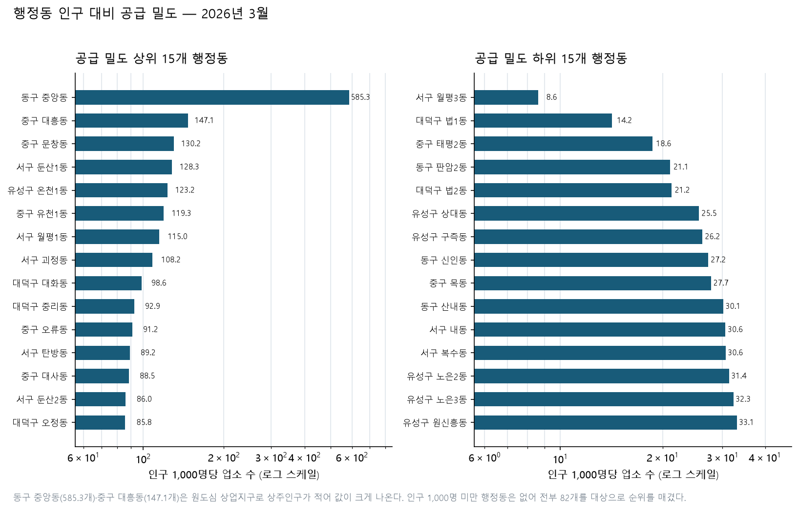
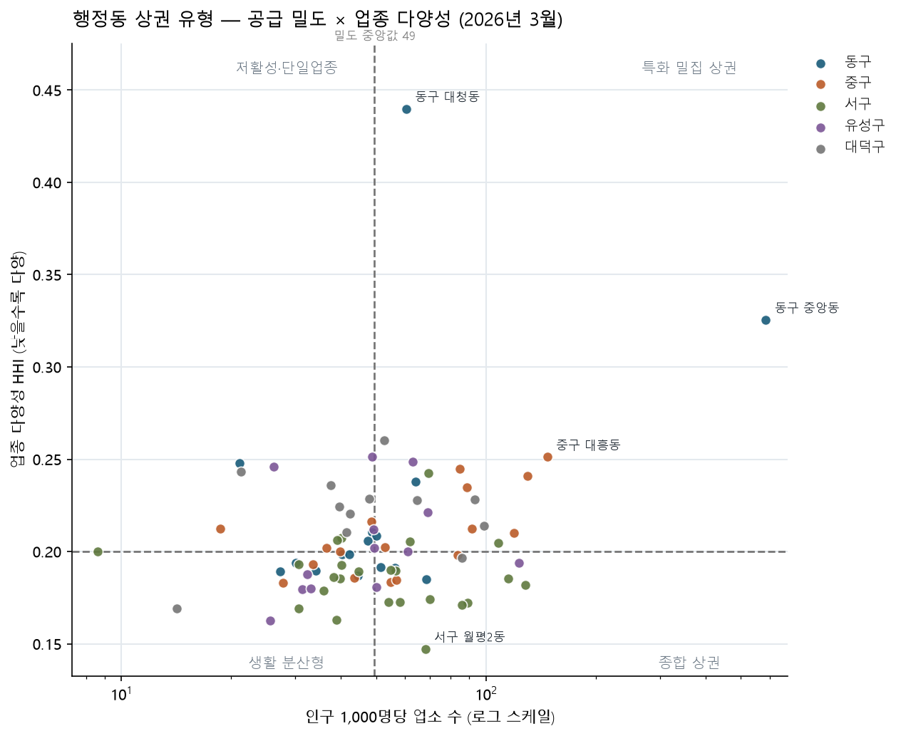

# 대전 상권 데이터 분석

> **대전 82개 행정동의 점포 공급 밀도, 업종 특화도, 다양성, 인구 구조와 점포 잔존율을 분석한 프로젝트입니다.**

[](https://www.python.org/)
[](analysis.ipynb)
[](https://www.data.go.kr/data/15083033/fileData.do)
[](REPORT.md)

**바로가기:** [📈 인터랙티브 대시보드](interactive-dashboard.html) · [📘 분석 리포트](REPORT.md) · [🧭 분석 계획](ANALYSIS_PLAN.md) · [📓 기초 분석 노트북](analysis.ipynb)

---

## 무엇을 분석했나요?

상가 수가 많다는 사실만으로 상권이 좋은지 판단할 수 없습니다. 이 프로젝트는 상가정보에 행정동 주민등록인구를 결합해 다음 질문을 확인합니다.

1. 인구에 비해 점포가 많은 행정동은 어디인가?
2. 특정 업종이 대전 평균보다 집중된 지역은 어디인가?
3. 업종이 고르게 구성된 상권과 한 업종에 집중된 상권은 어디인가?
4. 고령·청년 인구 비율과 업종 구성은 관련이 있는가?
5. 같은 업소번호가 오래 남아 있는 행정동은 어디인가?

---

## 핵심 결과

| 지표 | 결과 |
| --- | --- |
| 공급 밀도 최고 | 동구 중앙동, 인구 1,000명당 **585.26개** |
| 공급 밀도 최저 | 서구 월평3동, 인구 1,000명당 **8.61개** |
| 가장 다양한 업종 구성 | 서구 월평2동, HHI **0.1473** |
| 가장 집중된 업종 구성 | 동구 대청동, HHI **0.4399**·음식점업 62.70% |
| 고령 비율↔보건의료 특화 | 상관계수 **+0.068**, 뚜렷한 관계 없음 |
| 2024-03 고정 코호트 잔존율 | 2026-03 기준 전체 **75.78%** |



중앙동·대흥동처럼 상업 기능이 강하고 상주인구가 적은 곳은 인구 대비 공급 밀도가 크게 나타납니다. 이 값은 매출이나 상권 활성도를 직접 뜻하지 않으므로 유동인구·매출과 함께 해석해야 합니다.

---

## 인터랙티브 대시보드

[interactive-dashboard.html](interactive-dashboard.html)을 내려받아 브라우저에서 열면 별도 서버 없이 사용할 수 있습니다. 배경 지도는 인터넷 연결이 필요합니다.

- **비교 기간 선택:** 시작·종료 시점을 자유롭게 골라 핵심 지표·증감 그래프·히트맵·상세 결과를 그 구간 기준으로 다시 계산. 수집범위 변화가 있었던 시점을 고르면 경고 문구 표시
- **관측 시점별 선 그래프:** 대전 전체·자치구·업종을 여러 항목 동시에 겹쳐 비교(10개 시점 전체)
- **자치구 × 업종 증감률 히트맵:** 선택한 기간 50개 조합의 증감을 색상과 툴팁으로 확인
- **관측 시점 슬라이더:** 2024년 3월~2026년 6월의 10개 시점 전환
- **원형 위치 분포:** 자치구, 업종, 낮음·중간·높음 밀도 필터
- **자치구 경계:** 선택한 영역을 강조하고 자동 확대
- **행정동 코로플레스:** 시점별 공급 밀도, HHI, 고정 코호트 잔존율 선택
- **행정동 산점도:** 선택한 시점·자치구의 공급밀도 × HHI를 산점도로 함께 확인
- **툴팁:** 행정동 이름과 정확한 지표 확인



---

## 데이터

| 자료 | 범위 | 출처 |
| --- | --- | --- |
| 상가(상권)정보 | 대전, 2024-03~2026-06, 10개 파일·763,839행 | [소상공인시장진흥공단](https://www.data.go.kr/data/15083033/fileData.do) |
| 행정동 주민등록인구 | 상가 관측월과 같은 10개 월말 | [행정안전부](https://www.data.go.kr/data/15097972/fileData.do) |
| 행정동 경계 | 2026-04-01 버전, 대전 82개 동 | [vuski/admdongkor](https://github.com/vuski/admdongkor) |
| 자치구 경계·배경 지도 | 대전 5개 자치구 | [OpenStreetMap](https://www.openstreetmap.org/) |

원본 파일은 수정하지 않으며 Git 저장소에 포함하지 않습니다. 분석 결과로 만든 집계 CSV와 경계 GeoJSON만 `data/processed/`에 저장합니다.

---

## 분석 지표

- **공급 밀도:** 행정동 업소 수 ÷ 주민등록인구 × 1,000
- **입지계수(LQ):** 행정동의 업종 비중 ÷ 대전 전체의 업종 비중
- **HHI:** 행정동 내 업종 비중 제곱의 합. 낮을수록 다양함
- **고정 코호트 잔존율:** 2024년 3월 수록 업소 중 이후 같은 번호가 남은 비율
- **인구 구조 상관:** 고령·청년 비율과 업종별 LQ의 피어슨 상관계수

자세한 공식, 관찰과 해석, 한계는 [REPORT.md](REPORT.md)에 있습니다.

---

## 빠르게 실행하기

### 1. 저장소 준비

```powershell
git clone https://github.com/Frost0313z/daejeon-commercial-analysis.git
cd daejeon-commercial-analysis
python -m venv .venv
.\.venv\Scripts\python.exe -m pip install -r requirements.txt
```

### 2. 원본 데이터 배치

상가 CSV를 `00. 대전 상권 데이터/`, 주민등록인구 CSV를 `01. 인구 데이터/`에 둡니다.

상가 파일명은 다음 형식을 사용합니다.

```text
소상공인시장진흥공단_상가(상권)정보_대전_YYYYMM.csv
```

필요한 상가 기준월은 다음 10개입니다.

```text
202403  202406  202409  202412  202503
202506  202510  202512  202603  202606
```

인구 파일은 각 관측월의 월말 자료를 사용합니다. 원본 폴더는 `.gitignore`로 제외됩니다.

### 3. 분석 재생성

```powershell
# 행정동 패널·인구·LQ·HHI·생존율
.\.venv\Scripts\python.exe commercial_analysis.py

# 82개 행정동 경계 자동 다운로드 및 코드 검증
.\.venv\Scripts\python.exe fetch_dong_boundaries.py

# 행정동 정적 시각화
.\.venv\Scripts\python.exe dong_visuals.py

# 시계열 수집 품질 진단
.\.venv\Scripts\python.exe quality_diagnostics.py

# 인터랙티브 HTML 생성
.\.venv\Scripts\python.exe dashboard.py
```

기초 시계열 데이터를 처음부터 다시 만들 때는 `analysis.ipynb`를 먼저 실행합니다.

```powershell
.\.venv\Scripts\python.exe -m jupyter nbconvert --to notebook --execute --inplace --ExecutePreprocessor.timeout=600 analysis.ipynb
```

---

## 결과물 안내

### 제출용 파일

| 파일 | 설명 |
| --- | --- |
| [REPORT.md](REPORT.md) | 분석 질문, 방법, 시각화, 인사이트, 결론과 한계 |
| [interactive-dashboard.html](interactive-dashboard.html) | 기간·지역·업종·행정동 지표를 바꿔 보는 대시보드 |
| [analysis.ipynb](analysis.ipynb) | 기초 시계열 분석 코드와 실행 결과 |
| [commercial_analysis.py](commercial_analysis.py) | 행정동 패널과 지표 생성 |
| [dong_visuals.py](dong_visuals.py) | 행정동 정적 그래프 생성 |
| [dashboard.py](dashboard.py) | 지도 데이터 집계와 HTML 생성 |

### 주요 가공 데이터

| 파일 | 설명 |
| --- | --- |
| [dong_panel.csv](data/processed/dong_panel.csv) | 82개 동 × 10개 업종 × 10개 시점 = 8,200행 균형 패널 |
| [dong_population.csv](data/processed/dong_population.csv) | 행정동별 10개 시점의 인구·연령 구조 |
| [dong_indicators.csv](data/processed/dong_indicators.csv) | 2026년 3월 공급 밀도·LQ·HHI·잔존율 |
| [dong_indicators_timeseries.csv](data/processed/dong_indicators_timeseries.csv) | 행정동 지표 10개 시점 |
| [dong_survival.csv](data/processed/dong_survival.csv) | 행정동별 고정 코호트 잔존율 시계열 |
| [population_category_correlation.csv](data/processed/population_category_correlation.csv) | 인구 구조와 업종 LQ 상관계수 |
| [daejeon_dong_boundaries.geojson](data/processed/daejeon_dong_boundaries.geojson) | 82개 행정동 경계와 조인 코드 |
| [store_location_grid_YYYYMM.csv](data/processed/store_location_grid_202603.csv) | 관측월별 0.01도 위치 격자 |

### 시각화

| 이미지 | 내용 |
| --- | --- |
| `images/09_dong_supply_density.png` | 공급 밀도 상·하위 15개 동 |
| `images/10_dong_lq_heatmap.png` | 82개 동 × 10개 업종 LQ |
| `images/11_diversity_vs_density.png` | 공급 밀도와 다양성 사분면 |
| `images/12_dong_survival.png` | 행정동별 고정 코호트 잔존율 |

---

## 프로젝트 구조

```text
daejeon-commercial-analysis/
├─ 00. 대전 상권 데이터/             # 원본 상가 CSV, Git 제외
├─ 01. 인구 데이터/                  # 원본 인구 CSV, Git 제외
├─ data/processed/                   # 재현 가능한 집계 데이터
├─ images/                           # 정적 시각화
├─ analysis.ipynb                    # 기초 시계열 분석
├─ commercial_analysis.py            # 행정동 지표
├─ fetch_dong_boundaries.py          # 행정동 경계 수집
├─ dong_visuals.py                   # 행정동 그래프
├─ quality_diagnostics.py            # 수집 품질 진단
├─ dashboard.py                      # 인터랙티브 HTML 생성
├─ interactive-dashboard.html
├─ REPORT.md
└─ requirements.txt
```

---

## 검증 상태

- 행정동 합계와 기존 자치구 패널의 50개 시점×자치구 조합 전수 일치
- 행정동·인구·경계 코드 **82/82 일치**
- 균형 패널 **8,200행**, 중복 키 0건
- 10개 업종의 업소 수 가중 LQ 평균 1.0
- HHI 0.1~1.0 범위와 고정 코호트 최초 시점 100% 확인
- PNG 직접 확인, 대시보드 JavaScript 문법 및 브라우저 필터 동작 확인

---

## 해석할 때 주의할 점

- 공급 밀도는 매출이나 상권 활성도가 아닙니다.
- 주민등록인구에는 직장인과 방문객이 포함되지 않습니다.
- 행정동 경계는 실제 상권 경계와 다릅니다.
- 업소번호 잔존율은 실제 사업자 폐업률과 다를 수 있습니다.
- 2024년 말 등 일부 회차에는 자료 수집범위 변화가 포함돼 있습니다.

분석 과정의 AI 사용 범위와 검증 방법은 [REPORT.md의 AI 사용 로그](REPORT.md#11-ai-사용-로그)에 기록했습니다.
