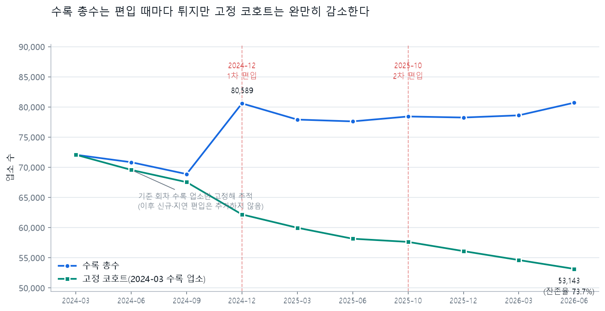
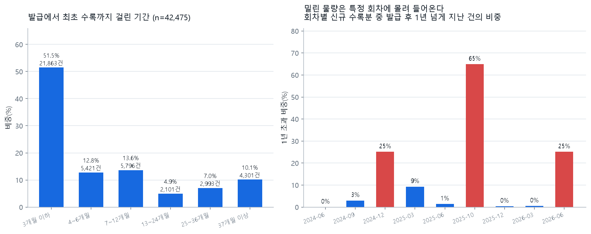

# 대전광역시 상권 변화 시계열 분석

## 1. 분석 배경 및 목적

대전광역시의 지역·업종별 상가 수가 어떻게 변했는지 비교하고, 관측된 변화가 실제 상권 성장인지 데이터 수집·정비 영향인지 구분하기 위한 분석이다. 분석 대상은 공공데이터 파일에 수록된 업소 수이며 법적 사업자등록 통계나 매출 통계가 아니다. 이하 “등록 상가 수”는 이 파일 수록 건수를 뜻한다.

메인 비교 구간은 **2025년 3월~2026년 3월**이다. 전체 상가 수는 **77,904개 → 78,607개, +703개(+0.90%)**다. 2024년 말의 큰 자료 단절과 업소번호 교체가 컸던 2026년 6월은 주요 성장률 계산에서 제외하고 민감도 점검에만 사용했다. 숫자의 증가를 창업 증가나 매출 개선으로 단정하지 않는 것이 이 분석의 핵심이다.

## 2. 분석 질문

1. 전체 등록 상가 수는 어떤 추세이며, 전분기·전년 동기 변화는 어떠한가?
2. 대전 5개 자치구의 변화 방향과 규모는 어떻게 다른가?
3. 어떤 대분류 업종이 전체 증가·감소에 크게 기여했는가?
4. 어느 구×업종 조합이 빠르게 변했고, 대전의 같은 업종과 반대 방향으로 움직였는가?

## 3. 데이터 설명

- 출처: 소상공인시장진흥공단, [공공데이터포털 상가(상권)정보](https://www.data.go.kr/data/15083033/fileData.do). 공공데이터포털에서 수집하여 사용자가 제공한 대전 지역 CSV를 사용했다. 이번 분석에서 원본을 새로 다운로드하거나 파일명을 변경하지 않았다.
- 기준월: 2024-03~2026-06, 파일 **10개**, 원본 **763,839행**. 같은 업소가 여러 시점에 반복되므로 이 합계는 고유 업소 수가 아니다.
- 각 파일은 **39개 컬럼**. 핵심은 상가업소번호, 시군구코드·명, 상권업종 대·중·소분류 코드·명이다.
- `period`는 파일명에서 추출한 기준월의 1일이다. 실제 조사일·개업일을 뜻하지 않는다. 별도의 관측일 컬럼은 없다.
- 분석 단위: 구×대분류×관측월 **500개 패널 관측치**, 그중 분기말 자료 **450개**, 메인 구간 분기말 자료 **200개**. 5개 구×10개 업종의 반복 관측이다.
- **시간축은 10개 관측월, 정상 분기말은 9개뿐이다.** 메인 구간에는 분기말 4개와 10월 보조 관측 1개가 있다. 패널의 500행을 500개 시간 시점으로 해석하면 안 된다. 과제의 “100개 이상 데이터 포인트” 요건은 구×업종×관측월 패널 관측치 **500개**로 충족한다. 다만 이는 독립적인 시간 시점 500개가 아니라 5개 구와 10개 업종의 반복 관측이며, 시간축은 관측월 10개(정상 분기말 9개)라는 점을 함께 밝힌다.
- 2025-09 파일이 없고 2025-10 파일이 있다. 10월을 3분기라고 간주하지 않는다. 10월과 12월은 같은 달력상 4분기지만 중복 합산하지 않으며 분기말 대표값은 12월이다.

| 기준월 | 파일명 | 행 수 | 컬럼 수 | 중복 업소번호 |
| --- | --- | --- | --- | --- |
| 2024-03 | 소상공인시장진흥공단_상가(상권)정보_대전_202403.csv | 72,067 | 39 | 0 |
| 2024-06 | 소상공인시장진흥공단_상가(상권)정보_대전_202406.csv | 70,832 | 39 | 0 |
| 2024-09 | 소상공인시장진흥공단_상가(상권)정보_대전_202409.csv | 68,867 | 39 | 0 |
| 2024-12 | 소상공인시장진흥공단_상가(상권)정보_대전_202412.csv | 80,589 | 39 | 0 |
| 2025-03 | 소상공인시장진흥공단_상가(상권)정보_대전_202503.csv | 77,904 | 39 | 0 |
| 2025-06 | 소상공인시장진흥공단_상가(상권)정보_대전_202506.csv | 77,605 | 39 | 0 |
| 2025-10 | 소상공인시장진흥공단_상가(상권)정보_대전_202510.csv | 78,418 | 39 | 0 |
| 2025-12 | 소상공인시장진흥공단_상가(상권)정보_대전_202512.csv | 78,246 | 39 | 0 |
| 2026-03 | 소상공인시장진흥공단_상가(상권)정보_대전_202603.csv | 78,607 | 39 | 0 |
| 2026-06 | 소상공인시장진흥공단_상가(상권)정보_대전_202606.csv | 80,704 | 39 | 0 |

## 4. 데이터 정제 및 품질 확인

### 4.1 컬럼·결측·중복

모든 파일의 컬럼명과 순서가 동일하다. 코드를 문자열로 읽어 선행 0을 보존하고, 빈 문자열·공백을 결측으로 통일했다. 상가업소번호·시도·구·상권업종 코드 및 명칭의 결측은 **0건**, 파일 내 중복 업소번호는 **0건**, 완전 중복 행은 **0건**이다. 따라서 집계용 행 삭제·추정값 대체는 하지 않았다. 같은 번호가 다른 시점에 반복되는 것은 정상적인 반복 관측이므로 제거하지 않는다.

지점명·건물명·층·동·호 등은 결측이 많지만 분석 집계에 쓰지 않으므로 그대로 보존했다. 표준산업분류의 일부 결측도 상권업종 분류가 존재하므로 제외 사유가 아니다. 좌표의 숫자 변환·전 세계 유효 범위 검사에서 **0건**이 발견됐다. 좌표를 집계에 사용하지 않으며, 이 검사는 대전 경계 내부 여부를 보증하지 않는다. 실제로 2025년 3월 회차는 이 검사를 통과하고도 좌표 전체가 대전 밖을 가리켰으며, 지도용 좌표에 한해 별도로 보정했다(→ [인터랙티브 대시보드](#인터랙티브-대시보드)).

| 컬럼 | 전체 결측 수 | 파일별 최대 결측률(%) |
| --- | --- | --- |
| 호정보 | 763,839 | 100.00 |
| 동정보 | 757,684 | 100.00 |
| 지점명 | 684,957 | 96.96 |
| 건물부번지 | 645,841 | 84.79 |
| 건물명 | 543,785 | 74.98 |
| 층정보 | 343,132 | 49.60 |
| 지번부번지 | 220,579 | 29.85 |
| 건물관리번호 | 1,777 | 0.50 |
| 표준산업분류명 | 197 | 0.03 |
| 표준산업분류코드 | 197 | 0.03 |
| 지번본번지 | 46 | 0.02 |
| 도로명코드 | 45 | 0.02 |
| 건물본번지 | 45 | 0.02 |

컬럼별·파일별 전체 결측표는 [missing_values.csv](data/processed/missing_values.csv), 컬럼명 39개와 순서는 [schema.csv](data/processed/schema.csv)에 저장했다. 핵심 컬럼 결측이나 내용이 충돌하는 식별자 중복을 새로 발견하면 코드가 중단되어 임의 집계하지 않는다.

### 4.2 행정구역과 업종 분류

전 기간 시도는 `30 / 대전광역시`이며, 구 코드·명은 `30110 / 동구`, `30140 / 중구`, `30170 / 서구`, `30200 / 유성구`, `30230 / 대덕구`로 동일하다. 행정동·법정동을 포함한 시점별 코드표와 변경 수는 [administrative_codes.csv](data/processed/administrative_codes.csv), [administrative_changes.csv](data/processed/administrative_changes.csv)에 남겼다. 구 단위 비교와 달리 동 경계의 공간적 동일성은 보증하지 않는다.

행정동·법정동 코드·명칭 집합에서도 관측 시점 간 추가·삭제는 없었다. 로컬 파일의 상권업종은 전 기간 **대분류 10개·중분류 74개·소분류 246개**이고 코드·명칭 집합의 추가·삭제가 없다. [공식 데이터 설명](https://www.data.go.kr/data/15083033/fileData.do)의 전국 체계는 10·75·247개로, 대전에서 관측된 집합과 구분한다. 전국 분류 중 대전 자료에 없는 업종이 있을 수 있으며, 이를 곧바로 누락 오류로 판단하지 않는다. 분류 집합은 동일해도 개별 업소의 분류 수정이나 수집 범위 변경은 가능하다.

| 기준월 | 대분류 | 중분류 | 소분류 |
| --- | --- | --- | --- |
| 2024-03 | 10 | 74 | 246 |
| 2024-06 | 10 | 74 | 246 |
| 2024-09 | 10 | 74 | 246 |
| 2024-12 | 10 | 74 | 246 |
| 2025-03 | 10 | 74 | 246 |
| 2025-06 | 10 | 74 | 246 |
| 2025-10 | 10 | 74 | 246 |
| 2025-12 | 10 | 74 | 246 |
| 2026-03 | 10 | 74 | 246 |
| 2026-06 | 10 | 74 | 246 |

### 4.3 업소번호 전이와 이상 징후

| 이전 | 현재 | 유지 | 등장 | 소멸 | 순변화 | 유지번호 업종변경 | 유지번호 구변경 | 상호·주소 일치 키 |
| --- | --- | --- | --- | --- | --- | --- | --- | --- |
| 2024-03 | 2024-06 | 69,558 | 1,274 | 2,509 | -1,235 | 0 | 0 | 189 |
| 2024-06 | 2024-09 | 68,766 | 101 | 2,066 | -1,965 | 0 | 0 | 3 |
| 2024-09 | 2024-12 | 63,476 | 17,113 | 5,391 | 11,722 | 754 | 0 | 1,459 |
| 2024-12 | 2025-03 | 74,950 | 2,954 | 5,639 | -2,685 | 0 | 0 | 380 |
| 2025-03 | 2025-06 | 75,032 | 2,573 | 2,872 | -299 | 0 | 0 | 300 |
| 2025-06 | 2025-10 | 73,704 | 4,714 | 3,901 | 813 | 0 | 0 | 1,218 |
| 2025-10 | 2025-12 | 76,074 | 2,172 | 2,344 | -172 | 0 | 0 | 162 |
| 2025-12 | 2026-03 | 75,705 | 2,902 | 2,541 | 361 | 0 | 0 | 179 |
| 2026-03 | 2026-06 | 70,458 | 10,246 | 8,149 | 2,097 | 20 | 0 | 2,508 |

“유지”는 두 파일에 모두 존재하는 번호다. “등장”과 “소멸”은 각각 집합 차집합으로 계산했다. 모든 구간에서 `등장−소멸=상가 수 순변화`를 검증했다. 마지막 열은 사라진 번호와 새 번호 사이에서 **상호명·도로명주소가 모두 같은 고유 조합 수**이며, 동일 실제 업소임을 확정하는 매칭은 아니다.

- 가장 큰 순증은 2024-09→2024-12의 **+11,722개(+17.02%)**다. **17,113개 등장·5,391개 소멸**이 동반됐다. 같은 구간 보건의료는 **+159.41%**, 교육은 **+67.82%**다. 2024→2025 경계보다 2024년 말의 단절이 더 크다.
- 2026-03→2026-06에는 **10,246개 등장·8,149개 소멸**, 합계가 이전 업소 수의 **23.40%**다. 순증률 **+2.67%**만 보면 이 교체 규모가 가려진다. 유지 번호의 대분류 변경도 **20건**이다.
- 이 급변을 오류라고 단정하여 삭제하거나 평활하지 않았다. 품질 경고로 보존하고, 메인 구간을 2025년 3월부터로 정하되 2026년 3월까지만 비교한 민감도 결과도 제시한다.
- 2024년 말 급변이 대전에 국한된 현상인지 확인하기 위해 **경기도 같은 회차(2024-09·2024-12)를 교차 검증**했다. 결과는 6.6절에 정리했다. 두 광역단체에서 같은 시점에 같은 업종이 거의 같은 배율로 늘어나므로, 수집·정비 영향은 더 이상 대전만의 가설이 아니다.
- 다만 **어떤 제도·연계 변경이 있었는지 밝힌 공식 공지는 이번 확인에서 확보하지 못했다.** 공공데이터포털 자료 설명은 변경 안내를 소상공인365 공지로 넘기고 있으나 본문을 열람하지 못했다. 데이터로 말할 수 있는 범위는 “전국적으로 동시에 일어난 데이터 처리 변화”까지이며, 그 행정적 배경은 추정이다. 실제 개폐업·자료 정비·등록 지연을 이 파일만으로 분리할 수 없다.

## 5. 분석 방법

1. **분기말 집계**: 파일명 월이 3·6·9·12월인 자료를 사용한다. 분기마다 구·업종별 업소번호 수를 집계한다. 원자료 주기와 맞추고 10월·12월 이중 합산을 방지하기 위함이다.
2. **전분기 변화율**: `(현재/3개월 전−1)×100`. 단순히 이전 행을 참조하지 않고 정확한 기준월을 찾는다. 2025년 9월이 없어 2025년 12월의 전분기 변화율은 계산하지 않는다.
3. **전년 동기 변화율**: `(현재/12개월 전−1)×100`. 같은 기준월을 비교하여 계절적 시점 차이를 줄인다. 그러나 2024년 말 단절을 가로지르는 비교는 수집 효과가 섞일 수 있어 별도 주의가 필요하다.
4. **기간 절대 증감·증감률**: 2025-03과 2026-03을 비교한다. 절대 증감량으로 총변화 기여를, 비율로 상대 변화를 본다. 분모가 0이면 비율은 결측으로 두고 절대량을 제시한다.
5. **구×업종 패널·선택적 중분류**: 50개 조합을 비교하고, 절대 증감량이 가장 큰 대분류 **음식점업**만 중분류로 살핀다.
6. **식별자 전이·민감도**: 같은 번호의 유지·등장·소멸과 2026년 6월 포함 여부를 비교하여 해석의 안정성을 점검한다.
7. **고정 코호트 생존율**: 2024년 6월 이전에 업소번호가 발급된 집합만 고정하고 회차마다 몇 개가 남아 있는지 센다. 나중에 편입된 업소는 이 집합을 키우지 못하므로, 수록 기준이 바뀌어도 흔들리지 않는 시계열을 얻는다.
8. **등재 지연 분포**: 업소번호에 포함된 발급 연월과 그 번호가 파일에 처음 실린 회차의 차이를 개월 단위로 집계한다. 자료가 실제 변화를 얼마나 늦게 반영하는지, 그 지연이 어느 회차에 몰리는지 측정한다.

추세는 여러 관측에 걸친 방향, 계절성은 같은 계절마다 반복되는 움직임, 노이즈는 일시적 변동을 뜻한다. 관측 분기가 짧고 결측·수집 단절이 있어 계절성을 확정할 수 없다. 이동평균·분해·예측은 핵심 문제를 해결하지 못하므로 적용하지 않았다. 전년 동기 변화율 자체가 계절성의 증명은 아니다. 대신 수록 기준 변경에 영향받지 않는 7·8을 적용해 2024년 구간까지 말할 수 있는 지표를 따로 만들었다.

## 6. 분석 결과

### 인터랙티브 대시보드

[인터랙티브 대시보드 열기](interactive-dashboard.html)에서 대전 전체·자치구·업종별 추이를 전환하고, 막대와 표에서 증감량·증감률을 확인할 수 있다. 2024년 3월부터 2026년 6월까지 **관측 시점 10개 각각의 업소 좌표 전체**를 0.01도 격자(시점별 2,204~2,321개)로 집계한 위치 지도도 포함했다. 지도 위 슬라이더를 드래그하면 시점을 바꿔 분포 변화를 볼 수 있고, 자치구와 업종을 선택하거나 파랑·보라·빨강 밀도 체크박스를 켜고 끌 수 있다. 자치구를 선택하면 해당 행정구역을 노란색 테두리와 반투명 면으로 강조하고 자동 확대한다. 밀도 구간의 기준값은 시점 간 비교가 가능하도록 전체 시점 공통으로 계산한다.

지도는 같은 격자에 속한 업소 수를 원의 크기와 농도로 표현한다. 원은 격자 중심이 아니라 그 격자에 속한 상가들의 무게중심에 놓는다. 격자 중심에 찍으면 마커가 0.01도 간격에 정렬돼 바둑판처럼 보이는데, 무게중심은 격자 안에서 중앙값 279m·최대 677m 떨어져 있어 실제 분포에 가까우면서 격자 정렬도 드러나지 않는다. 이는 밀집 위치를 탐색하기 위한 시점 단면이며, 상권 경계나 개별 점포의 정확한 위치를 뜻하지 않는다.

2025년 3월 원본 파일은 좌표계가 통째로 어긋나 있었다. 주소는 모두 대전인데 좌표는 위도 +0.8887도·경도 +1.2489도만큼 이동해 강원 남부를 가리켰다. 상가업소번호로 인접 회차(2024년 12월·2025년 6월)의 좌표를 되찾아 **77,904건 중 77,567건(99.6%)** 을 복원하고, 나머지 337건은 위 평행이동량만큼 되돌렸다. 보정 후 격자 분포는 인접 회차와 99% 이상 일치한다. 자치구·업종·업소 수 집계는 좌표를 쓰지 않으므로 이 보정에 영향받지 않는다. 배경 지도와 5개 자치구 경계는 OpenStreetMap 자료를 사용했으며, 배경 지도를 표시하려면 인터넷 연결이 필요하다.

### 6.1 전체 상가 수와 변화율

| 기준월 | 상가 수 | 전분기 대비(%) | 전년 동월 대비(%) |
| --- | --- | --- | --- |
| 2024-03 | 72,067 | — | — |
| 2024-06 | 70,832 | -1.71 | — |
| 2024-09 | 68,867 | -2.77 | — |
| 2024-12 | 80,589 | 17.02 | — |
| 2025-03 | 77,904 | -3.33 | 8.10 |
| 2025-06 | 77,605 | -0.38 | 9.56 |
| 2025-09 | — | — | — |
| 2025-12 | 78,246 | — | -2.91 |
| 2026-03 | 78,607 | 0.46 | 0.90 |

**관찰:** 메인 비교는 **+0.90%**이고, 2025년 12월 대비 변화율은 **+0.46%**, 전년 동기 대비는 **+0.90%**다. 2025-10 보조 관측은 **78,418개**다. 선의 빈 부분은 자료 결측이며 0개를 뜻하지 않는다.

**해석:** 파일에 수록된 업소 수는 늘었지만, 성장의 속도와 지속성은 자료 갱신 영향을 함께 검토해야 한다. 상단 세로축은 0에서 시작하지 않으므로 상승의 시각적 크기보다 표의 변화율을 우선한다.

### 6.2 5개 자치구 비교

| 자치구 | 시작 상가 수 | 종료 상가 수 | 증감(개) | 증감률(%) |
| --- | --- | --- | --- | --- |
| 서구 | 26,586 | 26,885 | 299 | 1.12 |
| 유성구 | 18,479 | 18,719 | 240 | 1.30 |
| 중구 | 13,034 | 13,105 | 71 | 0.54 |
| 대덕구 | 8,257 | 8,318 | 61 | 0.74 |
| 동구 | 11,548 | 11,580 | 32 | 0.28 |

**관찰:** 증가율 1위는 **유성구(+1.30%)**, 절대 증가량 1위는 **서구(+299개)**다. 메인 구간 5개 구 중 **5개 구가 증가**, **0개 구가 감소**했다.

메인 시작 이후 정확한 전분기 비교가 가능한 구×시점 **15개** 중 대전 전체와 반대 방향인 경우는 **0개**였다. 구별 변화의 큰 방향은 같고 증가 폭이 다르다는 결론이다. 2025년 9월 결측 전후의 방향은 이 검증에 포함하지 않았다.

**해석:** 구별 총량과 상대 변화는 서로 다른 정보를 준다. 구별 성장 원인을 인구 이동·개발 등으로 확정하려면 추가 자료가 필요하다. 세로축은 0에서 시작하지 않으며 별표는 10월 보조 관측이다.

### 6.3 업종별 증감

| 대분류 | 시작 상가 수 | 종료 상가 수 | 증감(개) | 증감률(%) |
| --- | --- | --- | --- | --- |
| 수리 및 개인 서비스업 | 10,264 | 10,691 | 427 | 4.16 |
| 소매업 | 19,853 | 20,184 | 331 | 1.67 |
| 교육 서비스업 | 5,274 | 5,542 | 268 | 5.08 |
| 부동산업 | 2,547 | 2,797 | 250 | 9.82 |
| 보건의료업 | 1,937 | 1,967 | 30 | 1.55 |
| 전문, 과학 및 기술 서비스업 | 6,839 | 6,842 | 3 | 0.04 |
| 숙박업 | 723 | 719 | -4 | -0.55 |
| 예술, 스포츠 및 여가관련 서비스업 | 3,603 | 3,591 | -12 | -0.33 |
| 사업시설 관리, 사업 지원 및 임대 서비스업 | 3,203 | 3,119 | -84 | -2.62 |
| 음식점업 | 23,661 | 23,155 | -506 | -2.14 |

**관찰:** 메인 시작·종료 비교에서는 **6개 대분류가 증가하고 4개가 감소**했다. 절대 증가량 1위는 **수리 및 개인 서비스업(+427개)**이고 가장 크게 감소한 업종은 **음식점업(-506개)**다. 업종 증감 합계는 전체 **+703개**와 일치한다. 상대 증가율 1위 **부동산업**은 **+9.82%**지만 절대 증가량은 **+250개**다.

**해석:** 업종별로 증가와 감소가 갈렸다. 성장률이 높은 작은 업종과 증가 점포 수가 많은 업종을 구별해야 지원·조사 대상을 정할 수 있다.

**선택적 중분류 분석 — 음식점업**

| 중분류 | 시작 상가 수 | 종료 상가 수 | 증감(개) | 증감률(%) |
| --- | --- | --- | --- | --- |
| 한식 음식점업 | 10,046 | 10,333 | 287 | 2.86 |
| 일식 음식점업 | 718 | 757 | 39 | 5.43 |
| 서양식 음식점업 | 629 | 652 | 23 | 3.66 |
| 중식 음식점업 | 831 | 837 | 6 | 0.72 |
| 구내식당 및 뷔페 | 206 | 203 | -3 | -1.46 |
| 동남아시아 음식점업 | 149 | 128 | -21 | -14.09 |
| 기타 간이 음식점업 | 4,842 | 4,599 | -243 | -5.02 |
| 비알코올 음료점업 | 3,932 | 3,637 | -295 | -7.50 |
| 주점업 | 2,308 | 2,009 | -299 | -12.95 |

이 대분류의 중분류 가운데 가장 크게 증가한 항목은 **한식 음식점업(+287개)**다. 중분류 증감 합계는 해당 대분류 증감과 일치한다. 이 역시 사업 실적 증가를 의미하지 않는다.

### 6.4 지역×업종 비교

**관찰:** 가장 높은 증가율은 **유성구·부동산업**, **710→837개(+17.89%)**다. 가장 낮은 변화율은 **유성구·사업시설 관리, 사업 지원 및 임대 서비스업**, **688→655개(-4.80%)**다. 모든 50개 조합의 시작 규모·절대 변화·도시 대비 차이는 [전체 비교표](data/processed/district_category_growth.csv)에 있다.

각 구에서 절대 증가량이 가장 큰 업종은 다음과 같다.

| 자치구 | 주요 증가 업종 | 시작 | 종료 | 증감 | 증감률(%) |
| --- | --- | --- | --- | --- | --- |
| 서구 | 수리 및 개인 서비스업 | 3,553 | 3,756 | 203 | 5.71 |
| 유성구 | 부동산업 | 710 | 837 | 127 | 17.89 |
| 대덕구 | 소매업 | 2,187 | 2,242 | 55 | 2.51 |
| 동구 | 소매업 | 3,385 | 3,436 | 51 | 1.51 |
| 중구 | 소매업 | 3,790 | 3,829 | 39 | 1.03 |

대전의 같은 업종과 증감 방향이 다른 조합은 **10개**다. 아래에는 도시와의 변화율 차이가 큰 순서로 최대 5개를 제시했다. 차이 단위는 퍼센트포인트다.

| 자치구 | 업종 | 시작 | 종료 | 증감 | 증감률(%) | 대전 동일업종(%) | 차이(%p) |
| --- | --- | --- | --- | --- | --- | --- | --- |
| 동구 | 사업시설 관리, 사업 지원 및 임대 서비스업 | 429 | 440 | 11 | 2.56 | -2.62 | 5.19 |
| 유성구 | 숙박업 | 135 | 138 | 3 | 2.22 | -0.55 | 2.78 |
| 중구 | 보건의료업 | 365 | 361 | -4 | -1.10 | 1.55 | -2.64 |
| 중구 | 음식점업 | 3,851 | 3,854 | 3 | 0.08 | -2.14 | 2.22 |
| 서구 | 예술, 스포츠 및 여가관련 서비스업 | 1,238 | 1,253 | 15 | 1.21 | -0.33 | 1.54 |

**해석:** 대전 전체 업종의 변화가 모든 지역에서 재현되는 것은 아니다. 작은 시작 규모 때문에 상대 변화율이 커질 수 있으므로 히트맵만으로 유망 입지를 정하지 않는다.

### 6.5 업소번호 교체와 민감도

**관찰:** 신뢰 구간인 2026년 3월까지는 **+703개(+0.90%)**다. 제외한 6월까지 포함하면 **+2,800개(+3.59%)**로 커진다. 마지막 구간의 순증 **+2,097개**는 신뢰 구간 순증의 **298.29%**이며, 식별자 등장·소멸 합계는 **18,395개**다. 이 그래프는 직전 관측 비교이므로 2025년 10월·12월의 간격은 각각 4개월·2개월이며 분기 비교와 구분한다.

| 업종 | 2025-03→2026-03(%) | 2025-03→2026-06(%) |
| --- | --- | --- |
| 교육 서비스업 | 5.08 | 2.37 |
| 보건의료업 | 1.55 | 0.36 |
| 부동산업 | 9.82 | 10.05 |
| 사업시설 관리, 사업 지원 및 임대 서비스업 | -2.62 | 9.49 |
| 소매업 | 1.67 | 1.82 |
| 수리 및 개인 서비스업 | 4.16 | 7.06 |
| 숙박업 | -0.55 | 25.03 |
| 예술, 스포츠 및 여가관련 서비스업 | -0.33 | 2.39 |
| 음식점업 | -2.14 | 0.80 |
| 전문, 과학 및 기술 서비스업 | 0.04 | 8.28 |

**해석:** 종료 시점을 하나 바꿨을 때 규모나 방향이 달라지는 업종은 지속 추세라고 단정하기 어렵다. 동일 상호·주소 키와 유지번호 분류 변경도 함께 검토하여 수집 정비·실제 변화의 가능성을 구분해야 한다.

### 6.6 수집 체계 변경 진단

앞 절들이 “무엇이 얼마나 변했는가”를 봤다면, 이 절은 “그 변화가 상권의 변화인가 자료의 변화인가”를 가른다.

**그림 6.** 2024-09→2024-12 순변화를 등장·소멸·업종 이동으로 나눈 결과다. 유지 번호의 업종 이동이 총량에 미친 효과는 **0개**다. 즉 이 구간의 급증은 코드 재분류가 아니라 **레코드 자체가 늘어난 것**이다.

#### 회차 전이별 모집단 안정성

고정 코호트는 정의상 늘어날 수 없는 집합이므로, **코호트가 증가한 회차가 곧 과거 업소가 새로 편입된 회차**다.

| 전이 | 유입률 | 교체율 | 코호트 증감 | 최대 점유율 변동 | 판정 |
| --- | ---: | ---: | ---: | --- | --- |
| 2024-03 → 2024-06 | 1.77% | 5.25% | -1,235 | 음식 -0.27p | 안정 |
| 2024-06 → 2024-09 | 0.14% | 3.06% | -1,965 | 음식 -0.42p | 안정 |
| 2024-09 → 2024-12 | 24.85% | 32.68% | +1,945 | 교육 +1.96p | **모집단 변경 의심** |
| 2024-12 → 2025-03 | 3.67% | 10.66% | -4,537 | 음식 -0.45p | 안정 |
| 2025-03 → 2025-06 | 3.3% | 6.99% | -2,262 | 음식 -0.33p | 안정 |
| 2025-06 → 2025-10 | 6.07% | 11.1% | +1,196 | 음식 -0.91p | **모집단 변경 의심** |
| 2025-10 → 2025-12 | 2.77% | 5.76% | -1,759 | 소매 +0.11p | 안정 |
| 2025-12 → 2026-03 | 3.71% | 6.96% | -1,741 | 음식 +0.31p | 안정 |
| 2026-03 → 2026-06 | 13.03% | 23.4% | +422 | 소매 -0.63p | **모집단 변경 의심** |

정상 회차의 유입률은 **2.77~3.71%**인데 2024-12는 **24.85%**다. 반대로 2024-09는 **0.14%**로, 신규가 사실상 들어오지 않았다. 편입은 한 번이 아니라 **2024-12(1차)와 2025-10(2차)** 두 번 일어났다.

#### 오염에 강한 지표: 고정 코호트 생존율

**그림 7.** 수록 총수(파랑)는 편입 때마다 튀지만, 2024년 6월 이전 발급분만 추적한 고정 코호트(초록)는 완만히 감소한다.

| 회차 | 수록 총수 | 고정 코호트 | 코호트 전분기 대비 | 잔존율 |
| --- | ---: | ---: | ---: | ---: |
| 2024-03 | 72,067 | 72,067 | — | 100.0% |
| 2024-06 | 70,832 | 70,832 | -1.71% | 98.29% |
| 2024-09 | 68,867 | 68,867 | -2.77% | 95.56% |
| 2024-12 | 80,589 | 70,812 | 2.82% | 98.26% |
| 2025-03 | 77,904 | 66,275 | -6.41% | 91.96% |
| 2025-06 | 77,605 | 64,013 | -3.41% | 88.82% |
| 2025-10 | 78,418 | 65,209 | 1.87% | 90.48% |
| 2025-12 | 78,246 | 63,450 | -2.7% | 88.04% |
| 2026-03 | 78,607 | 61,709 | -2.74% | 85.63% |
| 2026-06 | 80,704 | 62,131 | 0.68% | 86.21% |

수록 총수가 68,867에서 80,589으로 튀는 구간에서도 코호트는 -1.71%, -2.77%로 흐른다. **같은 업소들의 2년간 잔존율 86.2%는 수록 기준 변경과 무관하게 말할 수 있는 수치**다. 다만 코호트가 2024-12(+1,945), 2025-10(+1,196), 2026-06(+422)에 늘어나는데, 늘어날 수 없는 집합이 늘었다는 사실 자체가 **구 체계 업소조차 누락돼 있었다는 증거**다.

#### 자료는 실제 변화를 얼마나 늦게 반영하는가

**그림 8.** 업소번호 발급에서 파일 최초 수록까지의 지연이다. 첫 회차 수록분은 좌측 절단이므로 제외했다(n=42,475).

| 최초 수록 회차 | 신규 수록 | 지연 중앙값 | 90퍼센타일 | 1년 초과 | 2년 초과 |
| --- | ---: | ---: | ---: | ---: | ---: |
| 2024-06 | 1,274 | 0.0개월 | 0개월 | 0.0% | 0.0% |
| 2024-09 | 101 | 3개월 | 3개월 | 3.0% | 3.0% |
| 2024-12 | 17,113 | 3개월 | 28개월 | 25.1% | 15.5% |
| 2025-03 | 2,900 | 2.0개월 | 5개월 | 9.3% | 7.4% |
| 2025-06 | 2,552 | 2.0개월 | 3개월 | 1.4% | 1.4% |
| 2025-10 | 3,417 | 33개월 | 38개월 | 64.9% | 53.8% |
| 2025-12 | 2,113 | 2개월 | 3개월 | 0.4% | 0.4% |
| 2026-03 | 2,879 | 3개월 | 9개월 | 0.5% | 0.4% |
| 2026-06 | 10,126 | 9.0개월 | 46개월 | 25.1% | 25.0% |

전체 지연은 **중앙값 3개월, 평균 10.4개월**이고 **22.1%가 1년을 넘는다**. 분포의 꼬리가 길어 어느 회차의 값도 그 시점의 상태와 정확히 일치하지 않는다. 특히 **2025-10 회차는 지연 중앙값이 33개월이고 65%가 1년 초과**로, 밀린 물량이 특정 회차에 몰려 들어오는 구조를 보여준다.

#### 경기도 교차 검증

대전만의 현상인지 확인하기 위해 경기도 같은 회차를 같은 방법으로 분석했다.

| 업종 | 대전 2024-09 | 대전 2024-12 | 대전 증감률 | 경기 2024-09 | 경기 2024-12 | 경기 증감률 |
| --- | ---: | ---: | ---: | ---: | ---: | ---: |
| 보건의료 | 744 | 1,930 | **+159.4%** | 6,585 | 17,476 | **+165.4%** |
| 교육 | 3,104 | 5,209 | **+67.8%** | 29,639 | 57,097 | **+92.6%** |
| 시설관리·임대 | 2,730 | 3,208 | **+17.5%** | 23,120 | 28,217 | **+22.1%** |
| 소매 | 18,179 | 20,857 | **+14.7%** | 132,587 | 156,125 | **+17.8%** |
| 음식 | 21,946 | 24,838 | **+13.2%** | 167,161 | 191,044 | **+14.3%** |
| 수리·개인 | 9,504 | 10,690 | **+12.5%** | 68,004 | 79,053 | **+16.2%** |
| 예술·스포츠 | 3,293 | 3,701 | **+12.4%** | 26,131 | 30,389 | **+16.3%** |
| 숙박 | 647 | 721 | **+11.4%** | 9,302 | 10,447 | **+12.3%** |
| 과학·기술 | 6,285 | 6,878 | **+9.4%** | 64,691 | 72,241 | **+11.7%** |
| 부동산 | 2,435 | 2,557 | **+5.0%** | 27,394 | 30,795 | **+12.4%** |

증가율 순위가 두 지역에서 같고 크기도 비슷하다. 보건의료는 대전 **+159.4%**·경기 **+165.4%**, 교육은 대전 **+67.8%**·경기 **+92.6%**다. 소분류로 내려가면 치과의원이 대전 **2.65배**·경기 **2.66배**로 거의 일치하는 반면, 카페(1.13배·1.17배)와 미용실(1.12배·1.17배)은 1.1~1.2배에 머문다. **업종에 따라 배율이 갈리고 그 패턴이 지역과 무관하게 같다는 점이 실물 변화가 아닌 자료 처리 변화의 근거**다. 경기도 2024-09 파일 역시 2024년 6월 이후 발급된 번호가 한 건도 없어, 수집 정지도 전국적으로 동일했다.

> 경기도 원본은 저장소에 포함하지 않았다. `01. 경기도 상권 데이터/`에 같은 형식의 파일을 두고 `quality_diagnostics.py`를 실행하면 이 절의 표가 재생성된다.

## 7. 주요 인사이트

### 인사이트 1. 2026년 6월 포함 여부가 결론의 크기를 바꾼다

**관찰:** 신뢰 구간인 2025-03→2026-03은 **+0.90%**지만 2026년 6월까지 포함하면 **+3.59%**다. 제외 구간의 순증 **+2,097개**는 신뢰 구간 전체 순증 **+703개**의 **298.29%**다. 근거는 그림 1·5다.

**해석:** 실제 업소 증가와 자료 갱신 영향이 함께 작용했을 가능성이 있다. 교체 규모가 크므로 지속적인 창업 증가라는 해석은 지지하지 못한다.

**의미·후속 행동:** 제공기관의 갱신 이력, 사업자 개폐업 신고, 동일 상호·주소의 식별자 변경을 추가 확인한다. 다음 관측에서도 같은 방향이 유지되는지 점검한다.

### 인사이트 2. 지역 비교는 증가율과 증가량을 나누어 읽어야 한다

**관찰:** 증가율 1위 **유성구 +1.30%**, 절대 증가량 1위 **서구 +299개**다. 근거는 그림 2와 구별 증감표다.

**해석:** 지역의 시작 규모와 업종 구성 차이가 결과에 영향을 줄 수 있다. 상가 수 증가만으로 주민 소비나 지역경제가 더 좋아졌다고 말할 수 없다.

**의미·후속 행동:** 인구당 업소 수·업종 구성비와 카드매출을 함께 비교해 지역별 수요 변화 여부를 확인한다.

### 인사이트 3. 증가율 1위와 전체 증가에 가장 크게 기여한 업종은 다르다

**관찰:** 10개 대분류 중 **6개가 증가하고 4개가 감소**했다. **부동산업**은 **+9.82%·+250개**, **수리 및 개인 서비스업**은 **+4.16%·+427개**다. 반면 **음식점업은 -506개(-2.14%)**였고, 내부에서는 한식 음식점업이 **+287개**였지만 주점업 **-299개**, 비알코올 음료점업 **-295개**로 방향이 갈렸다. 근거는 그림 3과 중분류 표다.

**해석:** 시작 규모가 작은 업종은 적은 점포 증가에도 비율이 커진다. 공급 점포 수 변화는 수요나 수익성 변화와 같지 않다.

**의미·후속 행동:** 상대 비율과 절대량을 함께 보며 조사 대상을 정하고, 매출·고용 자료로 실제 사업 상황을 확인한다.

### 인사이트 4. 같은 업종도 지역마다 방향이 다르다

**관찰:** 구×업종 50개 중 **10개**는 대전 동일 업종과 반대 방향이다. **유성구·부동산업 +17.89%**와 **유성구·사업시설 관리, 사업 지원 및 임대 서비스업 -4.80%**처럼 차이가 크다. 근거는 그림 4와 반대 방향 조합 표다.

**해석:** 지역별 업종 구성·수집 범위·점포 이동 등의 영향일 수 있다. 가장 큰 비율이 가장 큰 상권 기회라는 뜻은 아니다.

**의미·후속 행동:** 해당 조합의 시작 업소 수와 절대 증감량을 확인하고 유동인구·공실·매출을 결합한 현장 조사 우선순위로 활용한다.

### 인사이트 5. 2024년 말 급증은 상권 변화가 아니라 전국 동시 데이터 개편이다

**관찰:** 2024-09→2024-12에 대전은 **+17.02%**, 경기는 **+21.32%** 늘었다. 증가율 순위가 두 지역에서 같고, 보건의료는 **+159.41%·+165.35%**, 교육은 **+67.82%·+92.64%**다. 소분류에서는 치과의원이 **2.65배·2.66배**로 거의 일치하는 반면 카페는 **1.13배·1.17배**에 그친다. 같은 구간에 신설된 소분류 코드는 두 지역 모두 **0종**이고, 유지 번호의 업종 이동이 총량에 미친 효과도 **0개**다. 근거는 그림 6과 6.6절 표다.

**해석:** 업종에 따라 배율이 갈리고 그 패턴이 지역과 무관하게 같다. 서로 다른 광역단체에서 같은 분기에 치과의원이 2.65배와 2.66배로 늘어나는 일은 개원 활동으로 설명되지 않는다. 그동안 수록되지 않던 업종군이 한꺼번에 편입된 것으로 보는 편이 자료와 맞다.

**의미·후속 행동:** 이 구간을 가로지르는 증감률·전년 동기 대비는 해석하지 않는다. 소상공인365 공지 원문과 제공기관 질의로 변경 내역을 확인한다.

### 인사이트 6. 편입은 두 번 있었고, 두 번째는 메인 구간 안에 있다

**관찰:** 고정 코호트는 늘어날 수 없는 집합인데 **2024-12에 +1,945**, **2025-10에 +1,196** 증가했다. 2025-10 재등장 3,239건 중 교육이 **+756**으로 가장 많다. 교육 점유율은 **4.51%(2024-09) → 6.46%(2024-12) → 7.12%(2025-10)** 로 두 계단 올랐고, 보건의료는 2024-12 이후 **2.49~2.50%** 로 고정된다. 2025-06→2025-10 교육 순증 **+304**는 입시·교과학원 **+168**, 음악학원 **+99**, 미술학원 **+38**이 전부 설명하며, 새로 등장한 교육업소 1,161건의 **72%(835건)** 가 2024년 6월 이전 발급분이고 그중 **538건이 2022-08 발급**이다.

**해석:** 학원 개원이 늘어난 것이 아니라 2024-12에 시작된 학원 업종 편입이 2025-10 회차까지 이어졌다. 메인 구간의 교육 **+268개**는 사실상 2025-10 한 회차의 점프로 만들어졌으며, 이는 구간 전체 순증 **+703개**의 **38%** 에 해당한다.

**의미·후속 행동:** 메인 구간의 업종별 증감 순위는 고정 코호트 기준으로 재계산해 순위가 유지되는지 검증해야 한다. 2025-10을 보조 관측치에서 제외하고 2025-06→2025-12→2026-03으로 연결하는 방법도 함께 검토한다.

### 인사이트 7. 이 자료는 변화 시점을 정확히 알려주지 않는다

**관찰:** 업소번호 발급에서 파일 최초 수록까지 걸린 기간은 **중앙값 3개월, 평균 10.4개월**이고, **22.1%가 1년, 17.2%가 2년을 넘는다**(n=42,475). 정상 회차의 지연 중앙값은 2~3개월에 1년 초과가 1% 미만이지만, **2025-10 회차는 중앙값 33개월에 1년 초과가 64.9%** 다. 2022-08에 일괄 발급된 번호가 2026-06 회차에 처음 실린 사례도 **2,433건** 있다. 근거는 그림 8이다.

**해석:** 대부분은 한 분기 안에 반영되지만 꼬리가 길고, 밀린 물량이 특정 회차에 몰려 들어온다. 어느 시점의 스냅샷도 그 시점의 실제 상태와 일치하지 않으며, 분기 증감률에는 실제 변화와 반영 지연이 섞인다.

**의미·후속 행동:** 절대 수의 분기 증감보다 시점 단면의 공간 분포, 지역 간 상대 비교, 업종 구성비, 고정 코호트 생존율처럼 지연에 강한 지표를 우선 사용한다.

## 8. 결론

Q1에 대해 메인 구간 등록 상가 수는 **+0.90%** 증가했다. Q2에서는 **유성구**의 상대 증가율이 가장 높고 **서구**의 절대 증가량이 가장 크다. Q3에서는 10개 대분류 중 6개가 늘고 4개가 줄었으며, **수리 및 개인 서비스업**이 증가량에 가장 크게 기여하고 **부동산업**의 증가율이 가장 높았다. **음식점업**은 가장 크게 감소했다. Q4에서는 같은 업종의 대전 전체 방향과 다른 조합이 **10개** 확인됐다.

가장 중요한 판단은 이 결과를 **자료에 수록된 상가 수 변화**로 해석하는 것이다. 2024년 말과 2026년 6월의 큰 식별자 교체를 제외한 구간에서도 소폭 증가는 확인되지만, 실제 상권 활성화·개폐업 변화는 추가 자료로 검증해야 한다. 또한 메인 구간 안의 2025-10 회차에 2차 편입이 있으므로, 업종별 순위는 6.6절의 진단과 함께 읽어야 한다.

## 9. 한계점

- 등록 상가 수는 매출·고용·유동인구·상권 활성도와 동일하지 않다.
- 신규 창업·폐업 여부와 발생일이 없으므로 식별자 등장·소멸을 개폐업으로 단정할 수 없다.
- 같은 분류 코드 집합이 유지되어도 수집 범위·등록 지연·분류 정비가 바뀔 수 있다. 공식 변경일은 확정하지 못했다.
- 메인 구간(2025-03~2026-03) 안의 2025-10 회차에 2차 편입이 있다. 모집단이 완전히 안정된 구간은 2025-12~2026-03뿐이며 이는 2개 회차에 불과해 단독 분석이 어렵다. 교육·부동산 업종의 증감은 이 영향을 크게 받는다.
- 고정 코호트 생존율은 편입에 영향받지 않지만 신규 개업이 제외된 감소 지표이므로, 상가 수 수준이 아니라 잔존율로만 해석해야 한다.
- 2025-10 파일의 실제 조사 기준일을 외부 원문과 대조하지 못했으므로 파일명을 그대로 사용했다. 2025-09 대체 자료라고 추정하지 않았다.
- 분기말 9개, 메인 분기말 4개로 장기 계절성·안정적인 예측에 부족하다. 데이터 포인트 요건은 패널 관측치 500개로 충족하지만 독립적인 시간 시점은 9개다. 결측을 보간하거나 월·일 자료로 늘려 이를 감추지 않았다.
- 패널 행은 같은 시간·지역 내에서 상관되어 있으며 독립 표본 500개가 아니다. 통계적 유의성·인과효과를 주장하지 않았다.
- 부동산 개발·소비·인구 등 외부 설명 변수를 포함하지 않았다. 상호·주소 일치도 동일 업소의 확정 증거가 아니다.
- 원본은 사용자 제공 파일이다. 해시는 이후 변경 여부를 확인하지만 공식 배포본과 동일하다는 외부 인증은 아니다.

## 10. AI 사용 로그

| 사용 작업 | 사용 이유 | 실제 검증 방법 |
| --- | --- | --- |
| 파일 탐색·결측·스키마·분류체계 검사 코드 | 반복 검사를 빠짐없이 실행 | 10개 전체 CSV 검사, 핵심 결측·중복·구 코드 검사, 코드 집합 시점 비교 |
| 집계·전분기·전년 동기 계산 | 반복 연산 구현과 대안 검토 | 표준 csv 모듈로 원본 전체 구×업종 집계를 독립 재계산, 합계 대조 |
| 이상 징후·메인 구간 선택 보조 | 수집 효과와 실제 변화 혼동 방지 | 식별자 집합의 유지·등장·소멸 및 순변화 등식, 종료 시점 민감도 비교 |
| 시각화·리포트 문장 작성 | 수치 전달과 관찰·해석 구분 | 집계 변수로 표·문장·그림 생성, 직접 변화율 계산 및 PNG 한글·축·잘림 확인 |
| 재현성 검사 | 숨은 상태·수정 오류 탐지 | 새 커널에서 노트북 전체 실행, 오류 출력 검사, 원본 SHA-256 전후 대조 |

사용자는 모든 파일의 구조와 식별자 변화를 먼저 비교하고 관찰과 해석을 분리하도록 요청했다. 분석 과정에서는 2025년 10월을 9월로 간주하지 않는 검증 지침을 추가 적용했다. AI가 분석 코드와 초안을 작성했다. 수치 검증은 코드로 실행했으며, 사용자가 아직 수행하지 않은 검토를 수행했다고 기록하지 않았다. 제출자는 특히 2024년 말 급증을 창업 증가로 단정할 수 없는 이유와, 2025년 12월 전분기 변화율을 비워 둔 이유를 직접 설명할 수 있어야 한다.

재현 방법과 출처·이용 조건은 [README.md](README.md), 전체 분석 과정과 실행 결과는 [analysis.ipynb](analysis.ipynb)에 있다.
