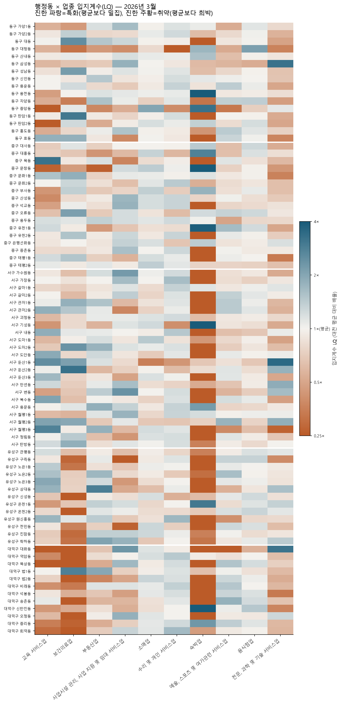
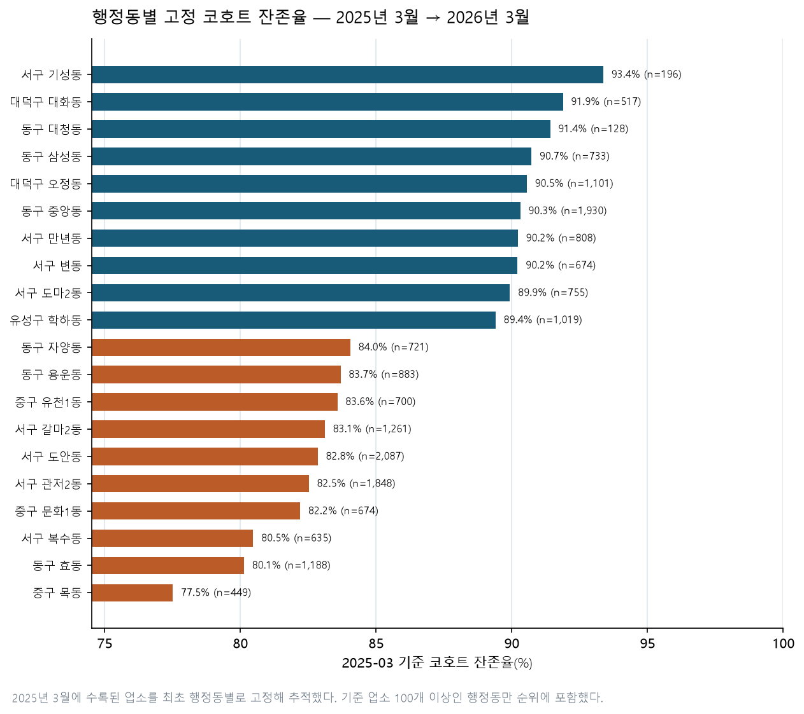

# 대전광역시 행정동 상권 공급 구조 분석

> 2025년 3월~2026년 6월 상가정보와 주민등록인구를 결합해 대전 82개 행정동의 공급 밀도, 업종 특화도, 다양성, 인구 구조와 점포 잔존율을 분석했다. 2024년 자료는 말미의 수집범위 단절(4.3) 때문에 분석 구간에서 제외했다.

## 목차

1. [분석 배경 및 목적](#1-분석-배경-및-목적)
2. [분석 질문](#2-분석-질문)
3. [데이터 설명](#3-데이터-설명)
4. [데이터 정제 및 품질 확인](#4-데이터-정제-및-품질-확인)
5. [분석 방법](#5-분석-방법)
6. [분석 결과](#6-분석-결과)
   - [6.1 행정동 공급 밀도](#61-행정동-공급-밀도)
   - [6.2 업종 특화도](#62-업종-특화도)
   - [6.3 다양성과 상권 유형](#63-다양성과-상권-유형)
   - [6.4 인구 구조와 업종 매칭](#64-인구-구조와-업종-매칭)
   - [6.5 행정동별 고정 코호트 잔존율](#65-행정동별-고정-코호트-잔존율)
   - [6.6 창업 입지와 경쟁 강도](#66-창업-입지와-경쟁-강도)
   - [6.7 상권 성장·위축 진단](#67-상권-성장위축-진단)
   - [6.8 인터랙티브 대시보드](#68-인터랙티브-대시보드)
7. [주요 인사이트](#7-주요-인사이트)
8. [결론](#8-결론)
9. [한계점](#9-한계점)
10. [재현 방법](#10-재현-방법)
11. [AI 사용 로그](#11-ai-사용-로그)

---

## 1. 분석 배경 및 목적

등록 상가 수의 증감만으로는 지역 상권의 성격을 설명하기 어렵다. 대전 전역을 같은 기준으로 비교할 수 있는 매출·유동인구 자료가 없어, 이 분석은 **행정동 인구를 배후수요의 대리 지표로 사용해 점포 공급 구조를 비교**한다. 인구 대비 업소 수, 입지계수(LQ), 업종 다양성(HHI), 고정 코호트 잔존율을 함께 보면 규모가 큰 지역과 특정 업종에 특화된 지역, 공급이 다양한 지역을 구분할 수 있다.

기존 시계열 품질 진단은 분석 구간을 정하는 근거로 사용했다. 2024년 말에 과거 발급 업소가 일괄 편입돼(4.3) 2024-09 이전과 이후는 같은 기준으로 비교할 수 없다. 그래서 **2024년 4개 시점을 지표·변화 분석·대시보드에서 모두 제외**하고, 단절 이후로 안정된 **2025년 3월~2026년 6월 6개 시점**만 사용했다. 상권 구조의 주 단면은 **2026년 3월**, 변화 비교와 고정 코호트 기준월은 **2025년 3월**로 잡았다. 2024년 자료는 이 구간을 정한 근거를 보이는 4.3에만 남겨 두었다.

---

## 2. 분석 질문

1. 행정동별 인구 1,000명당 업소 수는 얼마나 다르며 공급 밀도가 높은 곳과 낮은 곳은 어디인가?
2. 각 행정동은 어떤 업종에 특화돼 있는가?
3. 업종 구성이 다양한 상권과 특정 업종에 집중된 상권은 어디인가?
4. 고령·청년 인구 비율과 업종 특화도는 어떤 관계가 있는가?
5. 2025년 3월에 수록된 점포 중 2026년 3월에도 남아 있는 비율은 행정동별로 얼마나 다른가?
6. 특정 업종으로 창업한다면 어느 행정동이 경쟁이 적고, 어느 행정동이 이미 포화 상태인가?
7. 2025-03~2026-06 6개 시점을 함께 보면 점포 공급이 늘어나는(부흥) 상권과 정체·고교체 상태인 상권은 각각 어디인가?

---

## 3. 데이터 설명

| 자료 | 출처와 기간 | 분석 용도 |
| --- | --- | --- |
| 상가(상권)정보 | 소상공인시장진흥공단. 원본은 2024-03~2026-06 CSV 10개·763,839행이며, 수집범위가 안정된 **2025-03~2026-06 6개**만 분석에 사용(4.3) | 업소 수, 업종, 행정동, 좌표, 업소번호 |
| 행정동 주민등록인구 | 행정안전부, 분석에 쓴 상가 관측월과 같은 6개 월말 | 공급 밀도 분모, 고령·청년 인구 비율 |
| 행정동 경계 | `admdongkor` 2026-04-01, SGIS·행정안전부 경계 기반 | 행정동 코로플레스 지도 |
| 자치구 경계·배경 지도 | OpenStreetMap | 지도 위치와 자치구 강조 |

- 공간 단위: 대전 5개 자치구, **82개 행정동**
- 업종 단위: 대분류 10개
- 분석 패널: 82개 동 × 10개 업종 × 6개 시점 = **4,920행** (2024년 4개 시점 제외)
- 주 분석 시점: **2026-03**, 78,607개 업소·대전 인구 1,441,779명
- 출처: [공공데이터포털 상가정보](https://www.data.go.kr/data/15083033/fileData.do), [행정동 인구](https://www.data.go.kr/data/15097972/fileData.do), [행정동 경계 저장소](https://github.com/vuski/admdongkor)

원본 파일은 수정하지 않았다. 가공 CSV와 경계 GeoJSON만 `data/processed/`에 생성했다. 원본 상가·인구 파일은 용량과 재배포 조건을 고려해 Git에서 제외했다.

---

## 4. 데이터 정제 및 품질 확인

### 4.1 결측치와 0값

상가 집계에 필요한 업소번호, 자치구, 행정동, 업종은 전수 매칭됐다. 지점명·건물명·층·호 등 분석에 사용하지 않는 설명 컬럼의 결측은 원본에 그대로 두었다. 82개 행정동과 주민등록인구는 분석에 쓴 6개 시점 모두 **82/82 완전 매칭**됐다.

업소가 없는 동×업종×시점 조합 110개는 결측이 아니라 관측된 0이다. 이를 0으로 채워 4,810행의 희소 패널을 **4,920행 균형 패널**로 만들었다. 존재하지 않는 월이나 신규 업종의 과거 값을 임의로 0으로 만들지는 않았다.

### 4.2 좌표 이상치

위도·경도의 숫자 변환과 전 세계 유효 범위 검사에서는 오류가 없었다. 다만 **2025년 3월 좌표 전체**가 대전에서 위도 +0.8887도·경도 +1.2489도 이동한 공간 이상치로 확인돼 지도용으로만 다음과 같이 보정했다.

- 대상: 2025-03 좌표 77,904건
- 복원: 업소번호로 인접 회차 좌표를 연결해 77,567건(**99.6%**) 복원
- 보정: 연결 불가능한 나머지 337건은 회차의 중앙 이동량만큼 보정

상가 수와 업종 집계는 좌표를 쓰지 않으므로 이 이상치의 영향을 받지 않는다.

### 4.3 수집범위 변화


- 2024-09→2024-12 상가 수: 68,867개 → 80,589개 (**+11,722개, +17.02%**)
- 같은 구간 신규 등장 업소번호 17,113개, 사라진 번호 5,391개
- 실제 영업 변화와 과거 자료의 지연 편입이 섞여 있어, 한 분기에 +17%가 실제 개업이라고 볼 수 없다

2024년 3월에 실제 수록된 72,067개 업소를 고정한 코호트로 전 구간을 확인하면(이후 신규·지연 수록분은 코호트에 넣지 않았다) 다음과 같다.

- 2026년 3월: 54,611개 잔존 (**75.78%**)
- 2026년 6월: 53,143개 잔존 (**73.74%**)

**이 단절 때문에 6장의 지표·변화 분석·대시보드는 2024년 4개 시점을 모두 빼고 2025-03 이후만 사용하며, 고정 코호트도 2025-03 수록분으로 다시 잡았다(5.5, 6.5, 6.7).** 위 그래프와 2024-03 코호트 수치는 그 판단의 근거로만 남겨 둔 진단이다. 원본 CSV 10개는 수정 없이 보관한다.

---

## 5. 분석 방법

### 5.1 공급 밀도

`공급 밀도 = 행정동 업소 수 ÷ 행정동 인구 × 1,000`

상주인구 1,000명당 업소 수다. 인구가 적은 곳에서 비율이 과장되는 것을 막기 위해 인구 1,000명 미만 지역은 순위에서 제외하도록 했지만, 해당 행정동은 0개였다.

### 5.2 입지계수(LQ)

`LQ(i,j) = (i동의 j업종 비중) ÷ (대전 전체의 j업종 비중)`

LQ 1은 대전 평균, 1.2 이상은 상대적 특화, 0.8 미만은 상대적 취약으로 읽었다. 업소 수로 가중한 LQ 평균이 10개 업종 모두 1.0에 수렴하는지 검증했다. 소수 업소의 큰 비율을 과대해석하지 않도록 특화 순위는 해당 업종 업소가 20개 이상인 조합을 중심으로 해석했다.

### 5.3 업종 다양성(HHI)

`HHI(i) = Σ(행정동 내 업종 비중²)`

대분류 10개가 균등하면 0.1에 가깝고 특정 업종에 몰릴수록 1에 가까워진다. 공급 밀도와 HHI의 중앙값으로 네 유형을 나눴다.

| 공급 밀도 | HHI 낮음: 다양함 | HHI 높음: 집중됨 |
| --- | --- | --- |
| 높음 | 종합 상권 | 특화 밀집 상권 |
| 낮음 | 생활 분산형 | 저활성·단일업종 |

### 5.4 인구 구조와 업종 구성

행정동 82개를 표본으로 고령 인구 비율(65세 이상), 청년 인구 비율(20~39세)과 업종별 LQ의 피어슨 상관계수를 계산했다. 상관은 관련성만 나타내며 원인·결과를 뜻하지 않는다.

### 5.5 고정 코호트 잔존율

2025년 3월에 실제 수록된 업소번호를 최초 행정동별로 고정하고 이후 각 회차에 같은 번호가 남아 있는지 확인했다. 2024년을 빼면서 기준월도 첫 안정 분기인 2025-03으로 옮겼다. 이 코호트는 82개 동 모두 기준 업소가 100개 이상이라 전 동을 순위에 포함했다. 관측 창은 15개월(2025-03~2026-06)로 이전(약 2년)보다 짧다. 업소번호 변경이나 자료 누락은 폐업처럼 보일 수 있으므로 이 값은 사업자 생존율이 아니라 **동일 번호 잔존율**이다.

### 5.6 업종별 창업 경쟁 강도

`경쟁 강도(i,j) = i동의 j업종 업소 수 ÷ i동 인구 × 1,000`

LQ는 업종 *구성비*를 도시 평균과 비교하므로 특화 여부는 보여주지만, 실제로 몇 개의 동종 점포와 경쟁하게 되는지는 알려주지 않는다. 전체 업소 수가 적은 동은 특정 업종의 비중이 조금만 높아도 LQ가 크게 나오고, 반대로 전체 업소 수가 아주 많은 동은 특정 업종의 절대 개수가 많아도 비중은 평균 이하로 나올 수 있다. 이 경쟁 강도는 업종 구성비가 아니라 **인구당 동종 점포 수**를 직접 계산해 LQ를 보완한다. 인구 1,000명 미만 동은 5.1과 같은 이유로 순위에서 제외했다.

### 5.7 상권 성장·위축 진단

2024년 말 수집범위 확대(4.3)로 2024-09 이전과 이후는 같은 기준으로 비교할 수 없다. 그래서 2024년 4개 시점을 통째로 빼고 진단 구간을 단절 이후 **2025-03~2026-06 6개 관측 시점(15개월)**으로 잡았다. 시작점 2025-03은 데이터에 남긴 첫 안정 분기이며, 편입 직후인 2024-12를 시작값으로 쓰지 않아 그 노이즈를 비교에서 제외했다.

| 지표 | 계산 | 방향 |
| --- | --- | --- |
| 업소 수 증감률 | 2026-06 ÷ 2025-03 − 1 | 성장 +, 부진 − |
| 순증·순감 | 2026-06 − 2025-03 업소 수 | 작은 분모의 비율 과장을 보정 |
| 공급 밀도 증감률 | 인구 1,000명당 업소 수의 같은 구간 변화 | 성장 + |
| 고정 코호트 잔존율 | 2025-03 업소번호의 2026-06 잔존 비율(5.5) | 안정 높음, 교체 빠름 낮음 |

종합 점수는 증감률 백분위 순위에 0.6, 잔존율 백분위 순위에 0.4를 가중했다. 성장 속도에 무게를 두되, 성장이 빠른 점포 교체를 동반하는 동을 구분하기 위해 잔존율을 함께 반영했다. 입력은 `data/processed/dong_indicators_timeseries.csv`이며 자치구·업종 시계열로 교차 확인했다. 구간에 포함된 2025-10·2026-06에도 소규모 지연 편입 흔적이 있어(4.3), 이 진단은 절대 수치의 정밀 비교가 아니라 방향과 상대 순위를 읽는 용도다.

---

## 6. 분석 결과

### 6.1 행정동 공급 밀도


| 공급 밀도 상위 | 업소/인구 | 1,000명당 업소 | 공급 밀도 하위 | 업소/인구 | 1,000명당 업소 |
| --- | ---: | ---: | --- | ---: | ---: |
| 동구 중앙동 | 1,922 / 3,284 | 585.26 | 서구 월평3동 | 169 / 19,633 | 8.61 |
| 중구 대흥동 | 1,777 / 12,082 | 147.08 | 대덕구 법1동 | 171 / 12,040 | 14.20 |
| 중구 문창동 | 528 / 4,057 | 130.15 | 중구 태평2동 | 433 / 23,217 | 18.65 |
| 서구 둔산1동 | 2,084 / 16,243 | 128.30 | 동구 판암2동 | 160 / 7,601 | 21.05 |
| 유성구 온천1동 | 3,288 / 26,687 | 123.21 | 대덕구 법2동 | 304 / 14,312 | 21.24 |

**관찰:** 82개 동의 중앙값은 49.39개다. 중앙동은 중앙값의 11.8배이며 2위 대흥동의 약 4배다.

**해석:** 중앙동·대흥동은 상주인구보다 방문 목적의 상업 기능이 큰 원도심이다. 높은 값은 상권 활성도나 매출을 직접 뜻하지 않고, 상주인구만 분모로 쓸 때 도심 상업지가 크게 나타나는 특성을 보여준다.

### 6.2 업종 특화도



업소 20개 이상 조합에서 두드러진 특화는 서구 기성동 숙박업 **LQ 19.229(35개)**, 동구 용전동 숙박업 **5.711(70개)**, 서구 둔산1동 전문·과학·기술 서비스업 **3.479(631개)**, 서구 둔산2동 보건의료업 **3.238(237개)**, 중구 목동 교육 서비스업 **3.214(109개)**다.

**관찰:** 같은 대전 안에서도 업종 비중은 크게 다르다. 히트맵의 주황색은 업소가 없거나 평균보다 희박한 조합, 파란색은 평균보다 특화된 조합이다.

**해석:** LQ가 높은 곳은 해당 업종의 상대 비중이 높다는 뜻이다. 숙박업처럼 도시 전체 규모가 작은 업종은 수십 개만으로도 LQ가 크게 나타나므로 절대 업소 수를 함께 봐야 한다.

### 6.3 다양성과 상권 유형


공급 밀도 중앙값은 49.39, HHI 중앙값은 0.1999다. 네 유형은 종합 상권 20개, 특화 밀집 상권 21개, 생활 분산형 23개, 저활성·단일업종 18개로 나뉜다.

- 가장 다양한 곳: 서구 월평2동, **HHI 0.1473**
- 가장 집중된 곳: 동구 대청동, **HHI 0.4399**
- 대청동은 음식점업 비중이 **62.70%**, 음식점업 LQ가 **2.128**이다.

**해석:** 공급 밀도가 비슷해도 업종 구성은 다를 수 있다. 종합 상권은 여러 생활 기능이 함께 있고, 특화 밀집 상권은 특정 목적 방문과 연관된 업종이 상대적으로 강하다는 후속 가설을 세울 수 있다.

### 6.4 인구 구조와 업종 매칭

| 업종 | 고령 비율과 LQ 상관 | 청년 비율과 LQ 상관 |
| --- | ---: | ---: |
| 교육 서비스업 | -0.493 | -0.080 |
| 소매업 | +0.468 | -0.280 |
| 부동산업 | -0.405 | +0.225 |
| 숙박업 | +0.396 | -0.154 |
| 보건의료업 | +0.068 | -0.170 |

**관찰:** 고령 비율과 보건의료업 LQ의 상관은 +0.068로 거의 없다. 교육 서비스업은 -0.493, 소매업은 +0.468이다.

**해석:** 고령 인구가 많은 동에 병·의원이 상대적으로 더 집중돼 있다는 가설은 이 자료에서 지지되지 않는다. 의료 공급은 거주 인구 외에 교통 접근성, 중심지 기능, 병원 규모의 영향을 받을 수 있다. 소매업의 양의 상관도 고령화가 소매업을 만든다는 인과로 읽을 수 없다.

### 6.5 행정동별 고정 코호트 잔존율



잔존율은 2025년 3월 코호트가 2026년 3월까지(12개월) 같은 번호로 남은 비율이다.

| 상위 행정동 | 기준→잔존 | 잔존율 | 하위 행정동 | 기준→잔존 | 잔존율 |
| --- | ---: | ---: | --- | ---: | ---: |
| 서구 기성동 | 196→183 | 93.37% | 중구 목동 | 449→348 | 77.51% |
| 대덕구 대화동 | 517→475 | 91.88% | 동구 효동 | 1,188→952 | 80.13% |
| 동구 대청동 | 128→117 | 91.41% | 서구 복수동 | 635→511 | 80.47% |
| 동구 삼성동 | 733→665 | 90.72% | 중구 문화1동 | 674→554 | 82.20% |
| 대덕구 오정동 | 1,101→997 | 90.55% | 서구 관저2동 | 1,848→1,525 | 82.52% |

**관찰:** 전체 고정 코호트 잔존율은 86.39%다(12개월 기준). 82개 동의 최고와 최저 차이는 15.86%p다. 공급 밀도 1·2위인 중앙동(90.31%)·대흥동(84.88%)은 잔존율이 오히려 평균 수준 이상이고, 잔존율이 낮은 목동·효동·복수동은 밀도가 중간대인 생활권이다.

**해석:** 점포가 많은 원도심 상업지라고 해서 교체가 더 빠른 것은 아니며, 이 구간에서는 오히려 안정적이었다. 공급 밀도와 안정성은 별개 축이라 함께 봐야 한다. 업소번호 교체와 일시 누락이 포함될 수 있으므로 실제 폐업률로 단정하지 않으며, 관측 창이 12개월로 짧아 동 사이 차이가 이전 분석보다 작게 나타난다.

### 6.6 창업 입지와 경쟁 강도

2026년 3월 기준, 대전 전체 음식점업은 23,155개로 인구 1,000명당 평균 **16.06개**다. 같은 업종이라도 행정동별 경쟁 강도는 아래처럼 최대 80배 가까이 벌어진다.

| 경쟁이 적은 행정동(음식점업) | 인구 1,000명당 | LQ | 경쟁이 많은 행정동(음식점업) | 인구 1,000명당 | LQ |
| --- | ---: | ---: | --- | ---: | ---: |
| 서구 월평3동 | 1.58개 | 0.62 | 중구 대흥동 | 50.49개 | 1.17 |
| 대덕구 법1동 | 3.57개 | 0.85 | 중구 유천1동 | 43.49개 | 1.24 |
| 중구 태평2동 | 4.09개 | 0.74 | 유성구 온천1동 | 41.44개 | 1.14 |
| 서구 내동 | 6.09개 | 0.68 | 동구 대청동 | 37.87개 | 2.13 |
| 대덕구 법2동 | 6.57개 | 1.05 | 동구 중앙동 | **125.46개** | 0.73 |

**관찰:** 동구 중앙동은 음식점업 밀도가 인구 1,000명당 125.46개로 도시 평균의 약 7.8배지만, LQ는 0.73으로 오히려 대전 평균보다 낮다. 6.1에서 본 것처럼 중앙동은 전체 업종 공급 밀도(585.26개) 자체가 압도적으로 높아 음식점업 비중은 상대적으로 평균 이하이면서도 절대 경쟁 점포 수는 가장 많은 역전 현상이 나타난다. 반대로 서구 월평3동은 밀도(1.58개)와 LQ(0.62) 모두 낮아 두 지표가 같은 방향을 가리킨다.

**해석:** LQ만 보고 "평균 이하니 여유가 있다"고 판단하면 중앙동처럼 실제로는 동종 점포가 가장 밀집한 곳을 놓칠 수 있다. 예비 창업자는 (1) 이 경쟁 강도로 이미 붐비는 동을 걸러내고, (2) 인구 규모가 비슷하면서 경쟁 강도가 낮은 동 중에서 LQ가 지나치게 낮지 않은 곳(수요 자체가 없는 곳이 아닌지)을 함께 확인하는 두 단계 필터가 간단하지만 유효하다. 이 표는 음식점업 예시이며, 나머지 9개 업종에 대한 82개 동 전체 수치는 `data/processed/category_dong_competition.csv`에 있다.

### 6.7 상권 성장·위축 진단

단면은 2026년 3월이지만, 2024년을 제외한 **2025-03~2026-06** 6개 시점(5.7)으로 82개 동의 공급 변화를 정렬했다.

**전반적으로 완만한 성장세다.** 자치구 업소 수는 서구 +4.4%, 유성구 +3.6%, 중구 +3.4%, 대덕구 +3.0%, 동구 +2.4%로 모두 늘었고(순증은 서구 +1,167개로 가장 큼), 업종은 숙박업 +25.0%, 부동산업 +10.1%, 사업시설 관리·지원 +9.5%, 전문·과학·기술 서비스업 +8.3%, 수리·개인 서비스업 +7.1%가 견인했다. 감소한 업종은 없고 음식점업(+0.8%)·보건의료업(+0.4%)이 가장 정체됐다. 이 구간에서 업소 수가 뚜렷하게 줄어드는 상권은 없으며, 차이는 **성장 속도**와 **점포 교체 속도(잔존율)**에서 나타난다. 잔존율은 2025-03 코호트의 2026-06 기준 값이다.

**성장이 빠른 상권**

| 행정동 | 증감률 | 순증 | 잔존율 | 메모 |
| --- | ---: | ---: | ---: | --- |
| 서구 월평3동 | +82.2% | +83개 | 83.2% | 101→184개, 밀도 +86%. 작은 분모 |
| 유성구 상대동 | +26.5% | +141개 | 84.2% | 도안 방향, 순증 2위 |
| 대덕구 법1동 | +20.8% | +30개 | 86.8% | 성장·잔존율이 함께 높음 |
| 동구 판암2동 | +10.8% | +16개 | 85.8% | 작은 분모 |
| 중구 부사동 | +10.6% | +50개 | 84.7% | |
| 서구 월평2동 | +10.0% | +85개 | 83.8% | |
| 동구 판암1동 | +9.9% | +36개 | 84.8% | 성장·잔존율 모두 상위 |
| 중구 은행선화동 | +9.9% | +189개 | 85.2% | 순증 1위, 원도심 |

유성구 구즉동(+9.3%, +74개, 테크노밸리 배후)이 뒤를 잇는다.

**성장이 정체됐고 점포 교체가 빠른 상권** (종합점수 하위)

| 행정동 | 증감률 | 잔존율 | 메모 |
| --- | ---: | ---: | --- |
| 동구 자양동 | −0.7% | 81.7% | 순감 −5개 |
| 유성구 온천2동 | −0.3% | 80.4% | 순감 −10개, 유성 구도심 |
| 서구 복수동 | −0.2% | 76.5% | 거의 제자리, 잔존율 하위권 |
| 동구 용운동 | −0.3% | 81.3% | |
| 동구 효동 | +0.8% | 76.3% | 잔존율 82개 동 하위 |
| 중구 대흥동 | +0.4% | 82.1% | 공급 밀도 2위(6.1)인데 성장은 정체 |
| 대덕구 비래동 | −1.5% | 84.5% | 이 구간 최대 감소폭 |
| 중구 목동 | +5.3% | 73.7% | 잔존율 82개 동 최저, 그러나 업소 수는 증가 |

**관찰:** 성장은 서구 월평 일대, 유성구 도안·테크노(상대·구즉), 동구 판암, 그리고 원도심 은행선화동에 몰려 있다. 반대편은 "줄어드는" 상권이라기보다 **성장이 멈췄고 기존 점포가 빠르게 갈리는** 상권으로, 동구 자양동·효동, 유성구 온천2동, 서구 복수동 같은 노후 생활권이 여기 해당한다. 중구 대흥동은 공급 밀도 2위이면서 이 구간 성장은 +0.4%로 정체됐지만, 잔존율(82.1%)은 이전 분석과 달리 중위권이다. 중구 목동은 잔존율이 82개 동 최저(73.7%)인데도 업소 수는 +5.3% 늘어, 성장과 교체가 동시에 빠른 유형이다.

**해석:** 늘어나는 곳은 신규 택지·산업단지 배후의 생활 상권이고, 정체·고교체 상권은 이미 포화한 구도심·노후 생활권이다. 다만 이 진단은 점포 *수*와 *번호 잔존*만 보며, 남은 점포의 매출·업종 질 변화는 포함하지 않는다. 관측 창이 15개월로 짧아 절대 수치보다 방향과 상대 순위를 읽는 용도다.

**이 진단의 한계**

- 매출·유동인구·임대료·실제 폐업률이 없어 점포 *공급*의 변화만 본다. 점포 수가 정체돼도 매출은 늘 수 있고 그 반대도 가능하다.
- 잔존율은 동일 업소번호의 지속 여부라 번호 변경·자료 누락이 폐업처럼 보일 수 있다(5.5와 같은 한계).
- 업소 수가 적은 동은 몇 개의 증감만으로 비율이 크게 흔들린다(월평3동 101→184개). 순증·순감 절대 수를 함께 봐야 한다.
- 행정동 경계가 상권 경계와 달라 한 동에 성격이 다른 구역이 섞일 수 있다.
- 진단 구간에 든 2025-10·2026-06에도 소규모 지연 편입 흔적이 있어(4.3), 절대 수치의 정밀 비교보다 방향·상대 순위 용도로 읽어야 한다.

### 6.8 인터랙티브 대시보드

[인터랙티브 대시보드 열기](interactive-dashboard.html)

- 비교 기간 선택: 듀얼 손잡이 슬라이더로 시작·종료 시점을 드래그하면 핵심 지표·증감 그래프·히트맵·성장 진단·상세 결과가 그 구간으로 재계산된다. 2024년 말 단절 이전은 다룰 수 없어 슬라이더는 2025-03~2026-06 6개 시점만 담는다
- 관측 시점별 선 그래프: 자치구·업종·행정동을 여러 항목 동시에 겹쳐 비교(6개 시점 전체, 행정동은 자치구를 먼저 선택)
- 증감 막대그래프·상세 결과: 자치구·업종은 목록에서, 행정동은 자치구를 고른 뒤 검색해 개별 선택하고 증감 순으로 정렬해 확인
- 자치구 × 업종 증감률 히트맵: 선택한 기간 50개 조합의 증감을 색상·툴팁으로 확인(기본값 2025-03→2026-06)
- 상권 성장·위축 진단: 선택 구간의 증감률 × 잔존율 산점도와 부흥·정체 상위 요약(6.7)
- 관측월 슬라이더: 2025-03~2026-06의 6개 시점 전환
- 위치 원: 자치구·업종·밀도 색상 필터
- 자치구 선택: 경계 강조와 자동 확대. 자치구를 고르면 그 안의 행정동도 선택할 수 있어 원형 위치·행정동 색상·산점도가 해당 동으로 줌인·강조된다
- 행정동 색상: 각 시점의 공급 밀도, HHI, 고정 코호트 잔존율
- 행정동 산점도: 선택한 시점·자치구의 공급밀도 × HHI를 함께 확인
- 행정동에 마우스를 올리면 동명과 정확한 지표 표시

원 위치는 0.01도 격자 안 업소들의 평균 좌표다. 개별 점포의 정확한 위치를 공개하지 않으면서 분포 변화를 비교하기 위한 표현이다.

---

## 7. 주요 인사이트

1. **상주인구 대비 공급은 원도심에서 매우 높다.** 중앙동의 585.26개는 중앙값의 11.8배다. 이는 방문 수요가 큰 지역에서 주민등록인구만으로 수요를 대리할 때 나타나는 구조다. 유동인구·매출을 결합하기 전에는 과밀이나 성공으로 판정하지 않아야 한다.
2. **상권 규모와 업종 특화는 다른 정보다.** 둔산1동은 전문·과학·기술 서비스업 LQ 3.479와 631개라는 상대·절대 규모를 함께 갖는다. 반면 기성동 숙박업 LQ 19.229는 35개이므로 큰 비율만으로 시장 규모를 판단하면 안 된다.
3. **인구 구조만으로 생활 서비스 배치를 설명하기 어렵다.** 고령 비율과 보건의료 LQ의 상관은 +0.068에 그쳤다. 의료 접근성을 평가하려면 병상·종사자·대중교통·인접 동 이용까지 결합해야 한다.
4. **밀집도와 안정성은 함께 움직이지 않는다.** 공급 밀도 1·2위인 중앙동(잔존율 90.31%)·대흥동(84.88%)은 이 구간에서 오히려 평균(86.39%) 안팎으로 안정적이었고, 잔존율이 낮은 곳은 목동(77.51%)·효동(80.13%)처럼 밀도가 중간대인 생활권이었다. 상권 후보지를 볼 때 점포 수와 교체 속도는 별개 축으로 봐야 한다.
5. **자료 수집범위 변화는 별도 관리해야 한다.** 2024년 말 +17.02% 급증은 실제 개업만으로 해석할 수 없어, 2024년 4개 시점을 지표·변화 분석·대시보드에서 전부 제외했다. 단면 지표는 2026년 3월, 변화 비교와 고정 코호트 기준월은 2025년 3월로 잡았다(4.3).
6. **LQ가 낮다고 경쟁이 적은 것은 아니다.** 동구 중앙동은 음식점업 LQ가 0.73으로 평균 이하지만 인구 1,000명당 125.46개로 전 업종을 통틀어 가장 많은 동종 점포가 있다. 창업 입지처럼 절대 경쟁자 수가 중요한 질문에는 구성비 지표(LQ)와 인구당 밀도를 함께 봐야 한다.
7. **성장은 외곽 신시가지에 몰리고, 일부 노후 생활권은 정체·고교체 상태다.** 2025-03~2026-06 구간에서 자치구는 모두 +2~4% 늘었지만, 행정동으로 보면 서구 월평 일대와 유성구 도안·테크노(상대·구즉)가 두 자릿수로 성장하는 반면 동구 자양동·효동, 유성구 온천2동, 서구 복수동은 업소 수가 제자리이면서 잔존율도 하위권이다. 중구 대흥동은 공급 밀도 2위이지만 성장은 +0.4%로 멈췄고(잔존율은 82.1%로 중위), 중구 목동은 잔존율 최저(73.7%)인데도 업소 수는 +5.3% 늘었다. 점포 *수*의 방향만 본 진단이므로 매출·유동인구와 결합하기 전에는 흥망으로 단정하지 않는다(6.7).

---

## 8. 결론

대전 상권은 5개 자치구 총량보다 82개 행정동에서 훨씬 큰 차이를 보였다. 원도심과 주요 상업지는 인구 대비 공급이 높았고, 같은 밀도에서도 업종 다양성과 특화 방향이 달랐다. 공급 밀도, LQ, HHI, 동일 번호 잔존율을 함께 보면 “점포가 많은가”를 넘어 “어떤 기능에 특화됐고 구성이 다양한가, 기존 점포가 얼마나 유지되는가”를 구분할 수 있다.

이 결과는 점포 입지의 후보 지역을 좁히거나 추가 조사가 필요한 동을 찾는 탐색 자료로 쓸 수 있다. 최종 의사결정에는 매출, 유동인구, 임대료, 경쟁 점포의 규모와 현장 조사가 필요하다.

---

## 9. 한계점

- 매출·유동인구가 없어 공급 측면만 분석했다. 주민등록인구는 직장인과 방문객을 반영하지 않는다.
- 행정동 경계는 실제 상권 경계와 다르며 하나의 동 안에도 성격이 다른 상권이 섞일 수 있다.
- LQ와 HHI는 구성비 지표라 업소가 적은 지역에서 불안정하다.
- 업소번호 잔존율은 동일 번호의 지속 여부이며 법적 사업체 생존율이나 폐업률이 아니다.
- 2024년 말 수집범위 단절 때문에 2024년 4개 시점을 지표·변화 분석·대시보드에서 제외했다. 구간에 남은 2025-10·2026-06에도 소규모 지연 편입 흔적이 있다.
- 피어슨 상관계수는 선형 관련성만 나타내며 인과관계를 증명하지 않는다.
- 분석에 쓴 관측월은 6개(2025-03~2026-06, 약 15개월)로, 장기 계절성이나 미래 예측을 안정적으로 추정하기 어렵고 고정 코호트 창도 12~15개월로 짧다.
- 창업 경쟁 강도는 기존 점포 수만으로 계산한 **공급 측면 지표**다. 임대료, 매출, 폐업 위험, 실제 유동인구, 점포 규모·품질 차이는 반영하지 않으므로 창업 여부를 최종 결정하는 근거로 단독 사용해서는 안 된다.
- 상권 성장·위축 진단(6.7)은 점포 *수*의 방향만 본다. 남은 점포의 매출·업종 질 변화는 포함하지 않으며, 업소 수가 적은 동의 증감률은 크게 흔들리므로 순증·순감 절대 수와 함께 읽어야 한다.

---

## 10. 재현 방법

Python 3.10 이상에서 다음 순서로 실행한다.

```powershell
python -m pip install -r requirements.txt
python commercial_analysis.py
python fetch_dong_boundaries.py
python dong_visuals.py
python quality_diagnostics.py
python dashboard.py
```

상가 원본 CSV는 `00. 대전 상권 데이터/`, 행정동 인구 CSV는 `01. 인구 데이터/`에 둔다. 상세 파일명과 산출물은 [README.md](README.md)에 설명했다.

---

## 11. AI 사용 로그

| 항목 | 내용 |
| --- | --- |
| 사용 작업 | 전처리·검증 코드 초안, 지표 계산, 정적·인터랙티브 시각화, 문장 구조화 |
| 사용 이유 | 반복 집계 시간을 줄이고 계산·표현 대안을 빠르게 비교하기 위해 사용 |
| 검증 방법 | 원본↔행정동↔자치구 합계 전수 대조, 82개 코드 조인 확인, LQ 가중평균·HHI 범위·패널 행 수 assert, 그래프 직접 확인, 대시보드 브라우저 조작 및 JavaScript 문법 검사 |

최종 해석은 그래프의 관찰 수치와 지표의 한계를 구분해 작성했다. AI가 제안한 결과도 원본 집계와 대안 계산이 일치하지 않으면 채택하지 않았다.
